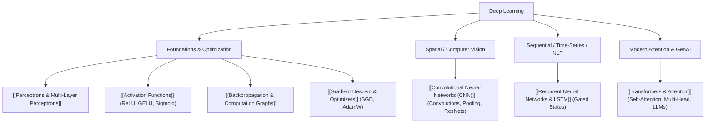

---
tags:
  - moc
  - machine-learning/deep-learning
aliases:
  - Deep Learning MOC
  - Deep Learning Hub
type: moc
created: 2026-08-17
---

# 🧠 Deep Learning Map of Content

> [!summary] **Deep Learning** is a subfield of machine learning based on artificial neural networks with representation learning. Instead of hand-crafting features, deep networks learn hierarchical feature representations directly from raw data through compositions of parameterized non-linear transformations.

---

## 🧭 Deep Learning Architecture Roadmap



---

## 🧱 1. Neural Network Foundations
- **[[Perceptrons & Multi-Layer Perceptrons]]**: The atomic unit of neural computing, linear combinations with non-linear activation, and the Universal Approximation Theorem.
- **[[Activation Functions]]**: Why non-linearity is essential; vanishing/exploding gradient problems, ReLU, LeakyReLU, GELU, Sigmoid, and Softmax.
- **[[Backpropagation & Computation Graphs]]**: Reverse-mode automatic differentiation, chain rule through computational graphs, forward and backward passes.
- **[[Loss Functions & Cost Functions]]**: Cross-Entropy, Mean Squared Error, CTC Loss, Triplet Loss.

---

## 👁️ 2. Computer Vision & Spatial Data
- **[[Convolutional Neural Networks (CNN)]]**:
  - *Core Concepts*: Translation equivariance, local receptive fields, parameter sharing, kernels, stride, padding, pooling.
  - *Evolution*: LeNet $\rightarrow$ AlexNet $\rightarrow$ VGG $\rightarrow$ ResNet (Residual Connections) $\rightarrow$ ConvNeXt.

---

## ⏳ 3. Sequence & Temporal Modeling
- **[[Recurrent Neural Networks & LSTM]]**:
  - *Core Concepts*: Recurrence relation $h_t = f(h_{t-1}, x_t)$, unrolling through time (BPTT).
  - *Gated Architectures*: Long Short-Term Memory (LSTM) with forget, input, and output gates; Gated Recurrent Unit (GRU).

---

## ⚡️ 4. The Modern Era: Transformers & Attention
- **[[Transformers & Attention]]**:
  - *Core Concepts*: Scaled Dot-Product Attention, Queries ($Q$), Keys ($K$), Values ($V$), Multi-Head Attention, Positional Encodings, Transformer Encoders (BERT) & Decoders (GPT).

---

## 🗂️ Notes in this Category (Dataview)

```dataview
TABLE difficulty AS "Difficulty", status AS "Status"
FROM "Machine Learning/05 - Deep Learning"
SORT file.name ASC
```

---
*Parent Hub: [[Machine Learning MOC]]*
