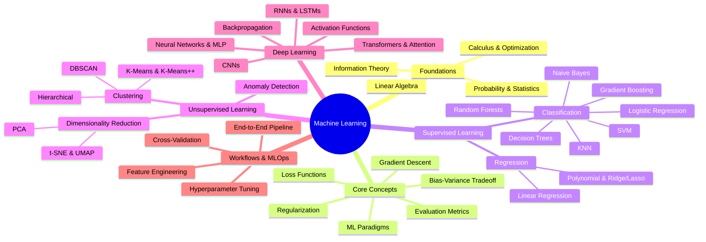

---
tags:
  - moc
  - machine-learning/hub
  - map-of-content
aliases:
  - ML MOC
  - Machine Learning Index
  - Machine Learning Map of Content
type: moc
created: 2026-08-17
---

# 🧭 Machine Learning Map of Content (MOC)

> [!quote] "A computer program is said to learn from experience $E$ with respect to some class of tasks $T$ and performance measure $P$, if its performance at tasks in $T$, as measured by $P$, improves with experience $E$."  
> — Tom M. Mitchell (1997)

Welcome to your **Machine Learning Second Brain**. This hub connects mathematical foundations, core algorithms, deep learning architectures, and practical end-to-end engineering workflows.

---

## 🗺️ Visual Architecture of Machine Learning



---

## 🚦 Recommended Learning Pathways

### Phase 1: 🧱 The Mathematical & Conceptual Bedrock
Before jumping to complex models, solidify how machines represent and learn from data:
1. [[Linear Algebra for ML]] — Vectors, matrices, projections, eigenvalues, and SVD.
2. [[Multivariate Calculus & Gradients]] — Gradients, directional derivatives, partial derivatives, chain rule.
3. [[Probability & Statistics for ML]] — Probability distributions, Bayes' theorem, expectation, variance, MLE & MAP.
4. [[Information Theory Basics]] — Entropy, Cross-Entropy, KL Divergence.
5. [[Machine Learning Paradigms]] — Supervised vs Unsupervised vs Reinforcement Learning.
6. [[Loss Functions & Cost Functions]] — How models measure their errors.
7. [[Gradient Descent & Optimizers]] — How models update their parameters to minimize loss.
8. [[Bias-Variance Tradeoff]] & [[Regularization Techniques]] — Overfitting vs Underfitting.

---

### Phase 2: 📊 Supervised Learning (Prediction & Estimation)
👉 **Deep-dive Hub**: [[Supervised Learning MOC]]

| Sub-Domain | Core Algorithms | Key Applications |
| :--- | :--- | :--- |
| **Regression** | [[Linear Regression]], Ridge/Lasso, Support Vector Regressors | Price estimation, trend forecasting, continuous measurements |
| **Linear Classification** | [[Logistic Regression]], [[Support Vector Machines (SVM)]] | Spam detection, medical diagnosis, credit default |
| **Tree-based & Ensembles** | [[Decision Trees]], [[Random Forests]], [[Gradient Boosting & XGBoost]] | Tabular data benchmarks, feature importance, churn prediction |
| **Instance & Probabilistic**| [[k-Nearest Neighbors (KNN)]], [[Naive Bayes]] | Text classification, recommender baselines, nearest searches |

---

### Phase 3: 🔍 Unsupervised Learning (Pattern Discovery)
👉 **Deep-dive Hub**: [[Unsupervised Learning MOC]]

- **Clustering**: [[K-Means & K-Means++]] | [[Hierarchical Clustering]] | [[DBSCAN]]
- **Dimensionality Reduction**: [[Principal Component Analysis (PCA)]] | [[t-SNE & UMAP]]
- **Outlier & Anomaly Detection**: [[Anomaly Detection Techniques]]

---

### Phase 4: 🧠 Deep Learning & Representation Learning
👉 **Deep-dive Hub**: [[Deep Learning MOC]]

- **Building Blocks**: [[Perceptrons & Multi-Layer Perceptrons]] | [[Activation Functions]] | [[Backpropagation & Computation Graphs]]
- **Spatial / Visual Data**: [[Convolutional Neural Networks (CNN)]]
- **Sequential / Temporal Data**: [[Recurrent Neural Networks & LSTM]]
- **Modern Foundation Models**: [[Transformers & Attention]]

---

### Phase 5: 🛠️ Practical Workflows, Validation & MLOps
- [[End-to-End ML Project Checklist]] — From problem framing to model deployment.
- [[Feature Engineering & Scaling]] — Handling categorical, numeric, and text features.
- [[Cross-Validation & Data Splits]] — Preventing information leakage during validation.
- [[Evaluation Metrics for ML]] — Confusion matrices, ROC-AUC, F1, RMSE, $R^2$.
- [[Data Leakage & How to Avoid It]] — Subtle bugs that fool your validation.
- [[Hyperparameter Tuning]] — Grid search, Random search, Bayesian optimization.

---

## 🗂️ Interactive Vault Dynamic Tables (Dataview)

```dataview
TABLE type AS "Type", difficulty AS "Difficulty", status AS "Status"
FROM "Machine Learning"
WHERE file.name != "Machine Learning MOC"
SORT file.folder ASC, file.name ASC
```

---

## 📌 Master Checklists & Existing Vault Roadmaps
- [[Roadmap for Learning Data Science]] — Comprehensive learning tracker with interactive checkboxes.
- [[Traditional Programming VS Machine Learning]] — Core mental shift notes.
- [[Linear Algebra(Coursera)/Week 1]] & [[Linear Algebra(Coursera)/Week 2]] — Vector and matrix lecture notes.
