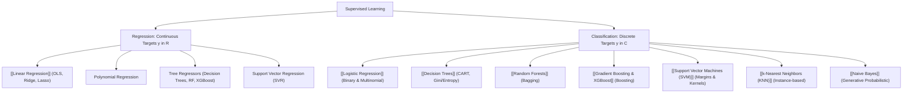

---
tags:
  - moc
  - machine-learning/supervised
aliases:
  - Supervised Learning MOC
  - Supervised Learning Hub
type: moc
created: 2026-08-17
---

# 📊 Supervised Learning Map of Content

> [!summary] **Supervised Learning** is the paradigm where a model learns an approximation function $f: \mathcal{X} \rightarrow \mathcal{Y}$ from labeled training pairs $\mathcal{D} = \{(\mathbf{x}_i, y_i)\}_{i=1}^n$. The objective is to minimize an expected risk or loss function over unseen data.

---

## 🧭 Supervised Learning Taxonomy



---

## 📈 1. Regression (Continuous Outputs)

Regression tasks estimate a continuous real number $\hat{y} \in \mathbb{R}$ given feature vector $\mathbf{x}$.

- **[[Linear Regression]]**: The foundational baseline. Fits a hyper-plane by minimizing Mean Squared Error (Ordinary Least Squares) or via Gradient Descent.
- **Regularized Regression**: 
  - Ridge ($L_2$ penalty) — controls coefficient explosion and multicollinearity.
  - Lasso ($L_1$ penalty) — enforces sparsity and performs feature selection.
  - ElasticNet — combination of $L_1$ and $L_2$.
- **Evaluation Metrics**: See [[Evaluation Metrics for ML]] for MSE, RMSE, MAE, MAPE, $R^2$, and Adjusted $R^2$.

---

## 🏷️ 2. Classification (Discrete Outputs)

Classification tasks map inputs to discrete categorical classes $\hat{y} \in \{C_1, C_2, \dots, C_k\}$.

### 🔹 Linear & Margin-Based Classifiers
- **[[Logistic Regression]]**: Models the log-odds of a class using the Sigmoid (or Softmax) function.
- **[[Support Vector Machines (SVM)]]**: Maximizes the geometric margin separating classes; uses the kernel trick for non-linear feature projections.

### 🔹 Non-Parametric & Instance-Based
- **[[k-Nearest Neighbors (KNN)]]**: "Lazy learner" that classifies new points based on the majority label of its $k$ closest neighbors in feature space.

### 🔹 Tree-Based & Ensemble Classifiers
- **[[Decision Trees]]**: Hierarchical partition of feature space using recursive splitting criteria (Gini Impurity, Information Gain).
- **[[Random Forests]]**: Ensemble of diverse, decorrelated decision trees using bootstrap aggregation (bagging) and random feature subsets.
- **[[Gradient Boosting & XGBoost]]**: Sequentially builds trees that fit the negative gradients (pseudo-residuals) of previous iterations.

### 🔹 Probabilistic / Generative Classifiers
- **[[Naive Bayes]]**: Applies Bayes' Theorem under the conditional independence assumption of features given the class label.

---

## ⚖️ Algorithm Decision Matrix

| Model | Interpretability | Speed (Train) | Speed (Inference) | Handles Non-Linearity? | Sensitivity to Outliers |
| :--- | :--- | :--- | :--- | :--- | :--- |
| **[[Linear Regression]]** | ⭐️⭐️⭐️⭐️⭐️ (High) | ⚡️⚡️⚡️ Fast | ⚡️⚡️⚡️ Fast | ❌ No (unless transformed) | 🔴 High |
| **[[Logistic Regression]]** | ⭐️⭐️⭐️⭐️⭐️ (High) | ⚡️⚡️⚡️ Fast | ⚡️⚡️⚡️ Fast | ❌ No (linear boundary) | 🟠 Moderate |
| **[[Decision Trees]]** | ⭐️⭐️⭐️⭐️ (Visual) | ⚡️⚡️ Fast | ⚡️⚡️⚡️ Fast | ✅ Yes | 🟢 Low |
| **[[Random Forests]]** | ⭐️⭐️ (Feature Imp.) | 🐢 Moderate | ⚡️⚡️ Fast | ✅ Yes | 🟢 Low |
| **[[Gradient Boosting & XGBoost]]** | ⭐️⭐️ (Shap/Imp.) | 🐢 Slower | ⚡️⚡️ Fast | ✅ Yes | 🟠 Moderate |
| **[[Support Vector Machines (SVM)]]**| ⭐️⭐️ Low | 🐢 Slow ($O(n^2 \sim n^3)$) | ⚡️⚡️ Fast | ✅ Yes (with Kernels) | 🟠 Moderate |
| **[[k-Nearest Neighbors (KNN)]]** | ⭐️⭐️⭐️ Moderate | ⚡️⚡️⚡️ Instant ($O(1)$) | 🐢 Slow ($O(n \cdot d)$) | ✅ Yes | 🔴 High |
| **[[Naive Bayes]]** | ⭐️⭐️⭐️⭐️ High | ⚡️⚡️⚡️ Instant | ⚡️⚡️⚡️ Instant | ❌ Linear log-posteriors | 🟢 Low |

---

## 🗂️ Notes in this Category (Dataview)

```dataview
TABLE difficulty AS "Difficulty", status AS "Status", task AS "Task"
FROM "Machine Learning/03 - Supervised Learning"
SORT file.name ASC
```

---
*Parent Hub: [[Machine Learning MOC]]*
