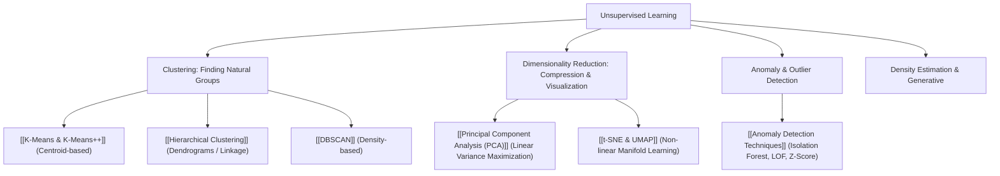

---
tags:
  - moc
  - machine-learning/unsupervised
aliases:
  - Unsupervised Learning MOC
  - Unsupervised Learning Hub
type: moc
created: 2026-08-17
---

# 🔍 Unsupervised Learning Map of Content

> [!summary] **Unsupervised Learning** discovers latent patterns, geometric clusters, compact low-dimensional representations, or anomalous behaviors from unlabeled datasets $\mathcal{D} = \{\mathbf{x}_i\}_{i=1}^n$ without human target labels $y$.

---

## 🧭 Unsupervised Learning Taxonomy



---

## 🔢 1. Clustering Algorithms (Grouping by Structure)

- **[[K-Means & K-Means++]]**:
  - *Core Concept*: Partitions data into $K$ spherical clusters by iteratively updating cluster centroids and minimizing inertia (Within-Cluster Sum of Squares, WCSS).
  - *Initialization*: K-Means++ prevents poor local minima by spreading out starting seeds.
- **[[Hierarchical Clustering]]**:
  - *Core Concept*: Builds a hierarchical tree (dendrogram) using agglomerative (bottom-up) or divisive (top-down) merging based on linkage criteria (Ward, Complete, Average).
- **[[DBSCAN]]**:
  - *Core Concept*: Identifies arbitrarily shaped clusters based on local density (core points, border points) and flags low-density points as noise/outliers.

---

## 📉 2. Dimensionality Reduction & Manifold Learning

- **[[Principal Component Analysis (PCA)]]**:
  - *Linear transformation*: Finds orthogonal axes (principal components) that capture the maximum variance of the dataset via eigendecomposition of the covariance matrix or Singular Value Decomposition (SVD).
- **[[t-SNE & UMAP]]**:
  - *Non-linear manifold learning*: Preserves local neighborhood distances in low dimensions ($2D/3D$) for high-dimensional visualization.

---

## 🚨 3. Anomaly & Outlier Detection

- **[[Anomaly Detection Techniques]]**:
  - *Isolation Forest*: Isolates anomalies by randomly partitioning feature space (anomalies require fewer splits).
  - *Local Outlier Factor (LOF)*: Measures local density deviation compared to neighbors.

---

## ⚖️ Clustering Algorithm Selection Matrix

| Algorithm | Shape of Clusters | Requires specifying $K$? | Handles Noise / Outliers? | Scalability ($N$) |
| :--- | :--- | :--- | :--- | :--- |
| **[[K-Means & K-Means++]]** | Spherical / Convex | ✅ Yes | ❌ Sensitive | ⚡️ Excellent ($O(N \cdot K \cdot d \cdot i)$) |
| **[[Hierarchical Clustering]]** | Any (depends on linkage) | ❌ Optional cut | 🟠 Sensitive to chains | 🐢 Poor ($O(N^2 \sim N^3)$) |
| **[[DBSCAN]]** | Arbitrary / Non-linear | ❌ No ($\epsilon, \text{min\_pts}$) | ✅ Robust (labels noise as $-1$) | ⚡️ Good with spatial indexing |

---

## 🗂️ Notes in this Category (Dataview)

```dataview
TABLE difficulty AS "Difficulty", status AS "Status", task AS "Task"
FROM "Machine Learning/04 - Unsupervised Learning"
SORT file.name ASC
```

---
*Parent Hub: [[Machine Learning MOC]]*
