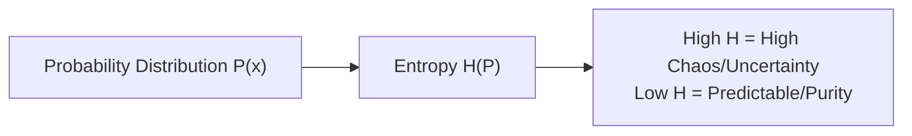

---
tags:
  - machine-learning/foundation
  - mathematics/information-theory
  - status/complete
aliases:
  - Information Theory
  - Entropy
  - Cross-Entropy
  - KL Divergence
type: foundation
difficulty: Intermediate
prerequisites:
  - "[[Probability & Statistics for ML]]"
created: 2026-08-17
---

# 📡 Information Theory Basics for Machine Learning

> [!summary] **Core Intuition**
> Information Theory quantifies **surprise, uncertainty, and information content** in data. When an outcome is rare (e.g., "snow in the Sahara"), learning it gives high information. When an outcome is certain (e.g., "the sun will rise"), it gives zero information.

---

## 🎯 Why Information Theory in Machine Learning?

Information theory gives us the fundamental metrics for:
1. **Splitting Decision Trees**: [[Decision Trees]] choose splits that maximize **Information Gain** (reduction in Entropy).
2. **Training Classifiers**: Neural networks and [[Logistic Regression]] minimize **Cross-Entropy Loss**.
3. **Generative Modeling**: Variational Autoencoders (VAEs) use **KL Divergence** to force latent spaces into standard distributions.
4. **Feature Selection**: **Mutual Information** measures non-linear dependencies between features and target labels.

---

## 🧭 Core Concepts & Mathematical Tools

### 1. Self-Information (Surprise)
The information content of observing an event $x$ with probability $P(x)$ is:

$$
I(x) = -\log_2 P(x) \quad (\text{measured in bits})
$$

- If $P(x) = 1 \implies I(x) = -\log_2(1) = 0$ bits (no surprise).
- If $P(x) = 0.125 = \frac{1}{8} \implies I(x) = -\log_2(1/8) = 3$ bits of surprise.

---

### 2. Shannon Entropy ($H$)
**Entropy** is the expected (average) information content or uncertainty of a probability distribution $P$:

> [!math] **Shannon Entropy**
> $$
> H(P) = -\sum_{i=1}^n P(x_i) \log_2 P(x_i)
> $$

- **Coin Toss Example**:
  - Fair coin ($P(\text{Heads}) = 0.5$): $H(P) = -(0.5 \log_2 0.5 + 0.5 \log_2 0.5) = 1.0\text{ bit}$ (**Maximum uncertainty**).
  - Biased coin ($P(\text{Heads}) = 0.99$): $H(P) \approx 0.08\text{ bits}$ (Very predictable).



---

### 3. Cross-Entropy ($H(P, Q)$)
If true labels follow distribution $P$ (e.g., one-hot $[1, 0, 0]$), and our model predicts probability distribution $Q$ (e.g., $[0.7, 0.2, 0.1]$), **Cross-Entropy** measures the average number of bits required to encode data from $P$ using code optimized for $Q$:

> [!math] **Cross-Entropy Formula**
> $$
> H(P, Q) = -\sum_{x} P(x) \log Q(x)
> $$

- When $Q = P$ (perfect predictions), Cross-Entropy reaches its minimum: $H(P, P) = H(P)$.

---

### 4. Kullback-Leibler (KL) Divergence
**KL Divergence** (also called *Relative Entropy*) measures the "distance" or statistical difference between two probability distributions $P$ and $Q$:

> [!math] **KL Divergence**
> $$
> D_{KL}(P \parallel Q) = \sum_{x} P(x) \log \left( \frac{P(x)}{Q(x)} \right) = H(P, Q) - H(P)
> $$

> [!warning] **Non-Symmetric Distance**
> $D_{KL}(P \parallel Q) \neq D_{KL}(Q \parallel P)$. It is not a true mathematical distance metric, but $D_{KL}(P \parallel Q) \ge 0$ always (Gibbs' Inequality), with equality if and only if $P = Q$.

---

### 5. Summary Relationship
$$
\underbrace{H(P, Q)}_{\text{Cross-Entropy (Loss)}} = \underbrace{H(P)}_{\text{Data Entropy (Constant)}} + \underbrace{D_{KL}(P \parallel Q)}_{\text{Prediction Error}}
$$

> [!tip] **Why We Minimize Cross-Entropy**
> Because $H(P)$ is fixed by the true training dataset, minimizing Cross-Entropy is mathematically identical to minimizing the KL divergence between true labels and model predictions!

---

## 💻 Python Demonstration (Entropy & Cross-Entropy)

```python
import numpy as np

def entropy(p):
    p = np.array(p)
    p = p[p > 0] # Avoid log(0)
    return -np.sum(p * np.log2(p))

def cross_entropy(p_true, q_pred):
    p_true = np.array(p_true)
    q_pred = np.clip(np.array(q_pred), 1e-12, 1.0) # Numerical stability
    return -np.sum(p_true * np.log(q_pred))

# 1. Fair coin vs Biased coin entropy
print(f"Fair Coin Entropy:   {entropy([0.5, 0.5]):.4f} bits")
print(f"Biased Coin Entropy: {entropy([0.9, 0.1]):.4f} bits")

# 2. Cross-entropy loss for 3 classes
y_true = [1.0, 0.0, 0.0]        # True class is index 0
good_pred = [0.85, 0.10, 0.05]   # Confident & correct
bad_pred  = [0.10, 0.80, 0.10]   # Confident & wrong

print(f"Loss for good prediction: {cross_entropy(y_true, good_pred):.4f}") # Low loss (~0.16)
print(f"Loss for bad prediction:  {cross_entropy(y_true, bad_pred):.4f}")  # High loss (~2.30)
```

---

## 🔗 Related Notes & Graph Connections
- **Foundation**: [[Probability & Statistics for ML]]
- **Downstream Applications**:
  - [[Loss Functions & Cost Functions]] (Categorical & Binary Cross-Entropy)
  - [[Decision Trees]] (Information Gain splitting criterion)
  - [[Logistic Regression]] (Log-loss objective)
- **Parent Hub**: [[Machine Learning MOC]]
