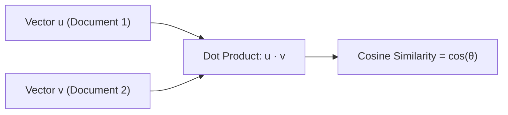

---
tags:
  - machine-learning/foundation
  - mathematics/linear-algebra
  - status/complete
aliases:
  - Linear Algebra
  - Linear Algebra for Machine Learning
type: foundation
difficulty: Beginner
prerequisites: []
created: 2026-08-17
---

# 📐 Linear Algebra for Machine Learning

> [!summary] **Core Intuition**
> Linear Algebra is the mathematical language of machine learning. Data is represented as **vectors** (data points) and **matrices** (datasets or transformations). Algorithms are geometric operations in high-dimensional vector spaces.

---

## 🎯 Why Linear Algebra in Machine Learning?

In ML, almost all data is arranged in tables:
- **Rows** = individual samples / observations ($n$).
- **Columns** = features / variables ($d$).
- **Dataset Matrix** $\mathbf{X} \in \mathbb{R}^{n \times d}$:
$$
\mathbf{X} = \begin{bmatrix}
x_{11} & x_{12} & \dots & x_{1d} \\
x_{21} & x_{22} & \dots & x_{2d} \\
\vdots & \vdots & \ddots & \vdots \\
x_{n1} & x_{n2} & \dots & x_{nd}
\end{bmatrix}
$$

When a model predicts an output, it computes a linear combination:
$$
\hat{y} = \mathbf{w}^T \mathbf{x} + b = w_1 x_1 + w_2 x_2 + \dots + w_d x_d + b
$$

---

## 🧭 Core Concepts & Mathematical Tools

### 1. Vectors, Norms & Distances
A vector $\mathbf{v} \in \mathbb{R}^d$ represents a point or arrow in $d$-dimensional space.

> [!math] **Vector Norms (Length & Magnitude)**
> - **$L_1$ Norm (Manhattan)**: Measures absolute distance (used in Lasso regularization):
>   $$\|\mathbf{v}\|_1 = \sum_{i=1}^d |v_i|$$
> - **$L_2$ Norm (Euclidean)**: Standard geometric straight-line length (used in Ridge regularization):
>   $$\|\mathbf{v}\|_2 = \sqrt{\sum_{i=1}^d v_i^2} = \sqrt{\mathbf{v}^T \mathbf{v}}$$
> - **$L_\infty$ Norm (Max Norm)**: Maximum absolute component:
>   $$\|\mathbf{v}\|_\infty = \max_i |v_i|$$

### 2. Dot Product & Cosine Similarity
The dot product $\mathbf{u} \cdot \mathbf{v}$ measures how much two vectors point in the same direction:
$$
\mathbf{u}^T \mathbf{v} = \|\mathbf{u}\|_2 \|\mathbf{v}\|_2 \cos(\theta)
$$

- If $\mathbf{u}^T \mathbf{v} = 0 \implies$ vectors are **orthogonal (perpendicular)** (zero correlation).
- **Cosine Similarity**: Normalized dot product (heavily used in NLP & Embeddings):
  $$\text{CosineSimilarity}(\mathbf{u}, \mathbf{v}) = \frac{\mathbf{u}^T \mathbf{v}}{\|\mathbf{u}\|_2 \|\mathbf{v}\|_2} \in [-1, 1]$$



---

### 3. Matrix Transformations & Rank
A matrix $\mathbf{A} \in \mathbb{R}^{m \times n}$ acts as a **linear function** that transforms vectors from $\mathbb{R}^n \rightarrow \mathbb{R}^m$:
- It can rotate, scale, shear, or project vectors.
- **Matrix Rank**: The number of linearly independent rows or columns.
  - Full rank means no feature is a redundant linear combination of other features.
  - If a dataset matrix is rank-deficient (collinear), ordinary least squares has infinite solutions!

---

### 4. Eigenvalues & Eigenvectors
For a square matrix $\mathbf{A}$, an **eigenvector** $\mathbf{v}$ is a special direction that doesn't rotate when multiplied by $\mathbf{A}$—it only scales by a factor $\lambda$ (the **eigenvalue**):

> [!math] **Eigenvalue Equation**
> $$
> \mathbf{A} \mathbf{v} = \lambda \mathbf{v}
> $$

- **Application in ML**:
  - In [[Principal Component Analysis (PCA)]], the eigenvectors of the covariance matrix point in the directions of **maximum data variance**, and the eigenvalues indicate the magnitude of variance along those axes.

---

### 5. Singular Value Decomposition (SVD)
Any real matrix $\mathbf{X} \in \mathbb{R}^{n \times d}$ can be factored into three matrices:

> [!math] **SVD Decomposition**
> $$
> \mathbf{X} = \mathbf{U} \mathbf{\Sigma} \mathbf{V}^T
> $$
> - $\mathbf{U} \in \mathbb{R}^{n \times n}$: Left singular vectors (orthonormal basis for rows/samples).
> - $\mathbf{\Sigma} \in \mathbb{R}^{n \times d}$: Diagonal matrix of singular values $\sigma_1 \ge \sigma_2 \ge \dots \ge 0$.
> - $\mathbf{V}^T \in \mathbb{R}^{d \times d}$: Right singular vectors (orthonormal basis for columns/features).

- **Why SVD is magic in ML**:
  - Powers dimensionality reduction, data compression, latent semantic analysis (LSA), recommender systems (matrix factorization), and pseudo-inverses ($\mathbf{X}^+$).

---

## 💻 Python Implementation (NumPy)

```python
import numpy as np

# 1. Vectors and Norms
u = np.array([3.0, 4.0])
print(f"L2 Norm: {np.linalg.norm(u, ord=2)}")  # Output: 5.0
print(f"L1 Norm: {np.linalg.norm(u, ord=1)}")  # Output: 7.0

# 2. Cosine Similarity between embeddings
v = np.array([6.0, 8.0])
cos_sim = np.dot(u, v) / (np.linalg.norm(u) * np.linalg.norm(v))
print(f"Cosine Similarity (parallel vectors): {cos_sim:.4f}")  # 1.0000

# 3. Eigendecomposition of a Covariance Matrix
cov_matrix = np.array([[2.0, 0.8], 
                       [0.8, 1.5]])
eigenvalues, eigenvectors = np.linalg.eig(cov_matrix)
print("Eigenvalues:", eigenvalues)
print("Eigenvectors:\n", eigenvectors)

# 4. Singular Value Decomposition (SVD)
X = np.random.randn(100, 5) # 100 samples, 5 features
U, S, Vt = np.linalg.svd(X, full_matrices=False)
print(f"Shapes -> U: {U.shape}, S: {S.shape}, Vt: {Vt.shape}")
```

---

## 🔗 Related Notes & Graph Connections
- **Vault References**: [[Linear Algebra(Coursera)/Week 1]], [[Linear Algebra(Coursera)/Week 2]]
- **Downstream Applications**:
  - [[Linear Regression]] (Normal Equation: $\mathbf{w} = (\mathbf{X}^T \mathbf{X})^{-1} \mathbf{X}^T \mathbf{y}$)
  - [[Principal Component Analysis (PCA)]] (Eigenvectors of $\mathbf{X}^T \mathbf{X}$)
  - [[Support Vector Machines (SVM)]] (Hyperplanes and dot product kernels)
- **Parent Hub**: [[Machine Learning MOC]]
