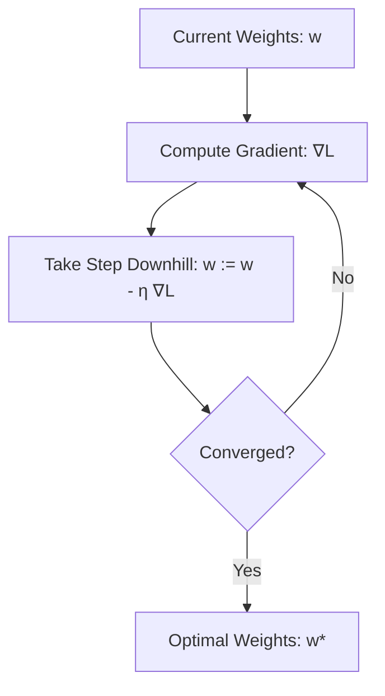

---
tags:
  - machine-learning/foundation
  - mathematics/calculus
  - status/complete
aliases:
  - Multivariate Calculus
  - Gradients
  - Calculus for ML
type: foundation
difficulty: Intermediate
prerequisites:
  - "[[Linear Algebra for ML]]"
created: 2026-08-17
---

# 📈 Multivariate Calculus & Optimization for Machine Learning

> [!summary] **Core Intuition**
> If Linear Algebra is how we **represent** data, Calculus is how we **learn** from data. Learning is framed as minimizing a loss surface $\mathcal{L}(\mathbf{w})$, and gradients point in the direction of steepest ascent. Taking steps opposite the gradient downhill leads to the optimal model weights.

---

## 🎯 The Geometric Picture: Navigating the Loss Landscape

Imagine being blindfolded on a foggy mountain (the loss landscape $\mathcal{L}(\mathbf{w})$). You want to reach the lowest valley (minimum error).
At each step, you feel the slope beneath your feet with your cane:
- The **slope** in each direction is the **partial derivative** $\frac{\partial \mathcal{L}}{\partial w_j}$.
- Combining all slopes into a vector gives the **Gradient** $\nabla \mathcal{L}(\mathbf{w})$.
- The gradient points **straight uphill**; stepping in $-\nabla \mathcal{L}(\mathbf{w})$ takes you **downhill**.



---

## 📐 Mathematical Toolbox

### 1. Partial Derivatives
For a multi-variable function $f(x_1, x_2, \dots, x_d)$, the partial derivative $\frac{\partial f}{\partial x_i}$ measures the rate of change of $f$ with respect to $x_i$, holding all other variables constant.

### 2. The Gradient Vector ($\nabla$)
The gradient gathers all partial derivatives into a single vector:

> [!math] **The Gradient Vector**
> $$
> \nabla_{\mathbf{w}} f(\mathbf{w}) = \begin{bmatrix}
> \frac{\partial f}{\partial w_1} \\
> \frac{\partial f}{\partial w_2} \\
> \vdots \\
> \frac{\partial f}{\partial w_d}
> \end{bmatrix} \in \mathbb{R}^d
> $$

- **Key Property**: $\nabla_{\mathbf{w}} f(\mathbf{w})$ points in the direction of **maximum rate of increase** of $f$.
- **Magnitude** $\|\nabla_{\mathbf{w}} f(\mathbf{w})\|_2$ equals that maximum rate of increase.

---

### 3. The Multivariate Chain Rule
Machine learning models (especially Deep Neural Networks) are compositions of functions: $f(g(h(\mathbf{x})))$.

> [!math] **Multivariate Chain Rule**
> If $z = f(y_1, y_2, \dots, y_m)$ and each $y_i = g_i(x_1, \dots, x_n)$, then:
> $$
> \frac{\partial z}{\partial x_j} = \sum_{i=1}^m \frac{\partial z}{\partial y_i} \frac{\partial y_i}{\partial x_j}
> $$

This exact equation powers **[[Backpropagation & Computation Graphs]]** in neural networks.

---

### 4. The Jacobian Matrix (Vector-Valued Functions)
If a function maps a vector to another vector $\mathbf{f}: \mathbb{R}^n \rightarrow \mathbb{R}^m$, its first-order partial derivatives form an $m \times n$ **Jacobian matrix** $\mathbf{J}$:

$$
\mathbf{J} = \begin{bmatrix}
\frac{\partial f_1}{\partial x_1} & \dots & \frac{\partial f_1}{\partial x_n} \\
\vdots & \ddots & \vdots \\
\frac{\partial f_m}{\partial x_1} & \dots & \frac{\partial f_m}{\partial x_n}
\end{bmatrix}
$$

### 5. The Hessian Matrix & Curvature (Second Derivatives)
For a scalar loss function $\mathcal{L}(\mathbf{w})$, the matrix of second-order partial derivatives is the **Hessian** $\mathbf{H} \in \mathbb{R}^{d \times d}$:

$$
\mathbf{H}_{ij} = \frac{\partial^2 \mathcal{L}}{\partial w_i \partial w_j}
$$

> [!tip] **Convexity & Hessian**
> - If $\mathbf{H}$ is **Positive Semi-Definite** ($\mathbf{v}^T \mathbf{H} \mathbf{v} \ge 0$ for all $\mathbf{v} \neq \mathbf{0}$), the function is **convex**, meaning every local minimum is a global minimum!
> - Used in second-order optimization methods (e.g., Newton-Raphson, L-BFGS).

---

## 💻 Python Demonstration (Numerical & Autograd)

```python
import numpy as np

# Simple quadratic loss: L(w1, w2) = w1^2 + 3*w2^2 + 2*w1*w2
def loss(w):
    return w[0]**2 + 3*w[1]**2 + 2*w[0]*w[1]

# Analytical gradient: [2*w1 + 2*w2, 6*w2 + 2*w1]
def analytical_gradient(w):
    dw1 = 2 * w[0] + 2 * w[1]
    dw2 = 6 * w[1] + 2 * w[0]
    return np.array([dw1, dw2])

# Simple Gradient Descent
w = np.array([10.0, 10.0]) # Initial starting point
learning_rate = 0.1

for step in range(30):
    grad = analytical_gradient(w)
    w = w - learning_rate * grad
    if step % 5 == 0:
        print(f"Step {step:2d} | w: [{w[0]:.4f}, {w[1]:.4f}] | Loss: {loss(w):.6f}")

print(f"\nFinal optimal weights: w* = {w.round(4)} (Expected: [0, 0])")
```

---

## 🔗 Related Notes & Graph Connections
- **Previous Foundation**: [[Linear Algebra for ML]]
- **Direct Applications**:
  - [[Gradient Descent & Optimizers]] (First-order optimization)
  - [[Loss Functions & Cost Functions]] (Loss formulations)
  - [[Backpropagation & Computation Graphs]] (Automated chain rule)
- **Parent Hub**: [[Machine Learning MOC]]
