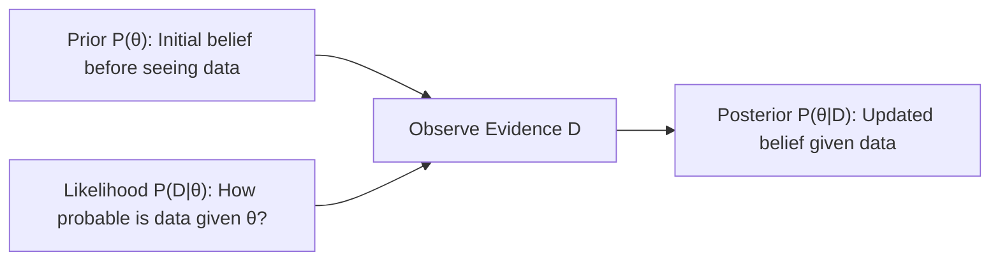

---
tags:
  - machine-learning/foundation
  - mathematics/probability
  - mathematics/statistics
  - status/complete
aliases:
  - Probability & Statistics
  - Probability for ML
  - Statistics for ML
type: foundation
difficulty: Beginner
prerequisites: []
created: 2026-08-17
---

# 🎲 Probability & Statistics for Machine Learning

> [!summary] **Core Intuition**
> Real-world data is noisy, incomplete, and uncertain. Probability provides the framework to **quantify uncertainty**, while Statistics gives us the tools to **estimate parameters** and draw inferences from finite data samples.

---

## 🎯 Why Probability Matters in ML

In machine learning:
1. **Inputs have noise**: Sensor inaccuracies, human errors, natural variation.
2. **Models output probabilities**: Instead of a hard binary statement, models output $P(\text{Spam} \mid \text{Email}) = 0.94$.
3. **Training is probabilistic inference**: We search for model parameters $\mathbf{\theta}$ that maximize the probability of having observed the training data (Maximum Likelihood Estimation).

---

## 🧭 Core Concepts & Mathematical Tools

### 1. Expectation, Variance & Covariance
For a continuous random variable $X$ with probability density function $p(x)$:

- **Expected Value (Mean $\mu$)**: The center of mass of the distribution:
  $$\mathbb{E}[X] = \int_{-\infty}^{\infty} x \, p(x) \, dx \quad \approx \frac{1}{N}\sum_{i=1}^N x_i$$

- **Variance ($\sigma^2$)**: The spread of data around its mean:
  $$\text{Var}(X) = \mathbb{E}[(X - \mathbb{E}[X])^2] = \mathbb{E}[X^2] - (\mathbb{E}[X])^2$$

- **Covariance**: Measures whether two variables move together:
  $$\text{Cov}(X, Y) = \mathbb{E}[(X - \mathbb{E}[X])(Y - \mathbb{E}[Y])]$$
  - Positive: When $X$ increases, $Y$ tends to increase.
  - Zero: No linear relationship.

---

### 2. Bayes' Theorem: Updating Beliefs with Evidence

> [!math] **Bayes' Theorem**
> $$
> P(\theta \mid \mathcal{D}) = \frac{P(\mathcal{D} \mid \theta) \, P(\theta)}{P(\mathcal{D})} = \frac{\text{Likelihood} \times \text{Prior}}{\text{Evidence}}
> $$



- **Prior $P(\theta)$**: What we believe about parameters before seeing data (acts as regularization!).
- **Likelihood $P(\mathcal{D} \mid \theta)$**: Probability of observing the data given parameters.
- **Posterior $P(\theta \mid \mathcal{D})$**: Updated belief after seeing data.

---

### 3. Key Probability Distributions in ML

| Distribution | Type | Use Case in ML | Formula $P(X=k)$ or $p(x)$ |
| :--- | :--- | :--- | :--- |
| **Gaussian (Normal)** | Continuous | Noise modeling, Weights initialization, [[Linear Regression]] residuals | $\frac{1}{\sigma \sqrt{2\pi}} e^{-\frac{(x-\mu)^2}{2\sigma^2}}$ |
| **Bernoulli** | Discrete ($0$ or $1$) | Binary classification targets in [[Logistic Regression]] | $p^k (1-p)^{1-k}$ |
| **Categorical / Multinomial** | Discrete ($K$ classes) | Multi-class classification with Softmax | $\prod_{k=1}^K p_k^{x_k}$ |

---

### 4. Maximum Likelihood Estimation (MLE) vs Maximum A Posteriori (MAP)

How do we pick model parameters $\mathbf{\theta}$ given training data $\mathcal{D} = \{x_1, \dots, x_n\}$?

#### A. Maximum Likelihood Estimation (MLE)
Pick $\mathbf{\theta}$ that makes the observed data most probable:
$$
\mathbf{\theta}_{\text{MLE}} = \arg\max_{\theta} P(\mathcal{D} \mid \mathbf{\theta}) = \arg\max_{\theta} \sum_{i=1}^n \log P(x_i \mid \mathbf{\theta})
$$
- *Connection*: Minimizing **Mean Squared Error** in Linear Regression is mathematically equivalent to MLE under the assumption of Gaussian noise!
- *Connection*: Minimizing **Binary Cross-Entropy** in Logistic Regression is equivalent to MLE under Bernoulli distributed targets!

#### B. Maximum A Posteriori (MAP)
Incorporate prior knowledge $P(\theta)$ into estimation:
$$
\mathbf{\theta}_{\text{MAP}} = \arg\max_{\theta} [ \log P(\mathcal{D} \mid \mathbf{\theta}) + \log P(\mathbf{\theta}) ]
$$
- *Connection*: A Gaussian prior on weights $P(\theta) \sim \mathcal{N}(0, \sigma_0^2)$ yields **$L_2$ Regularization (Ridge)**.
- *Connection*: A Laplace prior on weights yields **$L_1$ Regularization (Lasso)**.

---

## 💻 Python Demonstration (MLE in Action)

```python
import numpy as np
from scipy import stats

# Generate synthetic data with true mean=5.0, std=2.0
np.random.seed(42)
true_mu, true_sigma = 5.0, 2.0
data = np.random.normal(loc=true_mu, scale=true_sigma, size=500)

# Analytical MLE for Normal distribution
mle_mu = np.mean(data)
mle_sigma = np.std(data) # sqrt(1/N * sum((x - mu)^2))

print(f"True Params:       mu = {true_mu:.2f}, sigma = {true_sigma:.2f}")
print(f"MLE Fitted Params: mu = {mle_mu:.2f}, sigma = {mle_sigma:.2f}")
```

---

## 🔗 Related Notes & Graph Connections
- **Connects To**:
  - [[Information Theory Basics]] (Entropy & Divergence)
  - [[Loss Functions & Cost Functions]] (Negative Log-Likelihood)
  - [[Naive Bayes]] (Pure Bayesian classification)
  - [[Logistic Regression]] (Bernoulli MLE)
- **Parent Hub**: [[Machine Learning MOC]]
