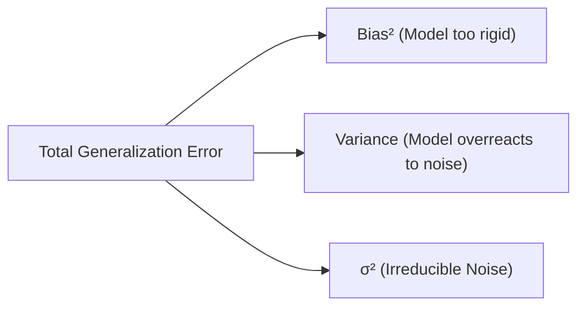

---
tags:
  - machine-learning/concept
  - status/complete
aliases:
  - Bias-Variance Tradeoff
  - Bias and Variance
  - Overfitting and Underfitting
type: concept
difficulty: Beginner
prerequisites:
  - "[[Probability & Statistics for ML]]"
created: 2026-08-17
---

# ⚖️ The Bias-Variance Tradeoff

> [!summary] **Core Intuition**
> The **Bias-Variance Tradeoff** is the central dilemma in supervised machine learning. 
> - **High Bias (Underfitting)**: The model is too simple to capture the underlying pattern (makes strong, incorrect assumptions).
> - **High Variance (Overfitting)**: The model is too complex and memorizes noise in the training set instead of the true generalizable relationship.

---

## 🎯 The Mental Model: The Dartboard Analogy

Imagine throwing darts at a bullseye (the true target function $f(x)$):

```
       Low Variance                 High Variance
     (Consistent/Tight)           (Scattered/Dispersed)
   +-----------------------+    +-----------------------+
   |        (   )          |    |       *               |
   |       (  *  )         |    |         *  (   )      |
   |        ( * )          |    |            ( * )      |
   |                       |    |       *        *      |
   +-----------------------+    +-----------------------+
        Low Bias (Accurate)          Low Bias (Accurate on Avg)
   
   +-----------------------+    +-----------------------+
   |   * *                 |    |   *                   |
   |  * *   (   )          |    |        *   (   )      |
   |         (   )         |    |             (   )     |
   |          ( )          |    |     *            *    |
   +-----------------------+    +-----------------------+
       High Bias (Off-target)        High Bias (Off-target & Scattered)
```

- **Bias**: How far off the model's average prediction is from the true value.
- **Variance**: How much the model's predictions fluctuate across different training datasets.

---

## 📐 Mathematical Decomposition of Expected Error

For a true data-generating process $y = f(\mathbf{x}) + \epsilon$, where $\epsilon \sim \mathcal{N}(0, \sigma^2)$ represents irreducible noise:

> [!math] **Mean Squared Error Decomposition**
> $$
> \mathbb{E}_{\mathcal{D}} \left[ (y - \hat{f}(\mathbf{x}))^2 \right] = \underbrace{\left( \mathbb{E}[\hat{f}(\mathbf{x})] - f(\mathbf{x}) \right)^2}_{\text{Bias}^2} + \underbrace{\mathbb{E}\left[ (\hat{f}(\mathbf{x}) - \mathbb{E}[\hat{f}(\mathbf{x})])^2 \right]}_{\text{Variance}} + \underbrace{\sigma^2}_{\text{Irreducible Error}}
> $$

- **$\text{Bias}^2$**: Error stemming from wrong algorithmic assumptions (e.g., assuming linear relationship when data is quadratic).
- **$\text{Variance}$**: Error from sensitivity to small fluctuations/noise in the training set.
- **$\sigma^2$ (Irreducible Error)**: Noise inherent in the universe/sensors that no model can ever predict.



---

## 📈 Model Complexity Curves

As model capacity (degrees of freedom, tree depth, polynomial degree) increases:
1. **Training Error** monotonically decreases toward zero.
2. **Validation / Test Error** forms a **U-shaped curve**:
   - High at first (underfitting zone $\rightarrow$ high bias).
   - Reaches a sweet spot minimum ($\text{Optimal Complexity}$).
   - Rises again (overfitting zone $\rightarrow$ high variance).

```
Error
  ^
  |      \                     /  <-- Validation/Test Error (U-shape)
  |       \     Sweet Spot    /
  |        \       v         /
  |         \______________/
  |          \
  |           \-----------------  <-- Training Error (Keeps dropping)
  +-------------------------------------> Model Complexity
      Underfitting           Overfitting
      (High Bias)           (High Variance)
```

---

## 🩺 Diagnostic Guide: How to Fix What Ails Your Model

| Symptom | Diagnosis | Root Cause | Remedies |
| :--- | :--- | :--- | :--- |
| **High Train Error, High Test Error** | **High Bias (Underfitting)** | Model lacks capacity to learn patterns | • Use a more complex model (e.g. Trees instead of Linear)<br>• Add polynomial / interaction features ([[Feature Engineering & Scaling]])<br>• Reduce regularization penalty $\lambda$ |
| **Low Train Error, High Test Error** | **High Variance (Overfitting)** | Model memorized training noise | • Collect more training data<br>• Apply [[Regularization Techniques]] ($L_1$, $L_2$, Dropout)<br>• Feature selection / dimensionality reduction ([[Principal Component Analysis (PCA)]])<br>• Use ensemble bagging ([[Random Forests]])<br>• Prune decision tree depth |

---

## 💻 Python Demonstration (Visualizing Polynomial Fits)

```python
import numpy as np
from sklearn.pipeline import make_pipeline
from sklearn.preprocessing import PolynomialFeatures
from sklearn.linear_model import LinearRegression
from sklearn.metrics import mean_squared_error

# True function: y = sin(x) + noise
np.random.seed(42)
X_train = np.sort(np.random.uniform(0, 5, 20)).reshape(-1, 1)
y_train = np.sin(X_train).ravel() + np.random.normal(0, 0.2, 20)

X_test = np.sort(np.random.uniform(0, 5, 100)).reshape(-1, 1)
y_test = np.sin(X_test).ravel() + np.random.normal(0, 0.2, 100)

for degree in [1, 4, 15]:
    model = make_pipeline(PolynomialFeatures(degree), LinearRegression())
    model.fit(X_train, y_train)
    
    train_mse = mean_squared_error(y_train, model.predict(X_train))
    test_mse  = mean_squared_error(y_test, model.predict(X_test))
    
    status = "UNDERFITTING (High Bias)" if degree == 1 else ("OPTIMAL" if degree == 4 else "OVERFITTING (High Variance)")
    print(f"Degree {degree:2d} | Train MSE: {train_mse:.4f} | Test MSE: {test_mse:.4f} -> {status}")
```

---

## 🔗 Related Notes & Graph Connections
- **Foundations**: [[Probability & Statistics for ML]]
- **Solutions**:
  - [[Regularization Techniques]] (Penalizing model complexity)
  - [[Cross-Validation & Data Splits]] (Detecting overfitting reliably)
  - [[Random Forests]] & [[Gradient Boosting & XGBoost]] (Ensemble variance & bias reduction)
- **Parent Hub**: [[Machine Learning MOC]]
