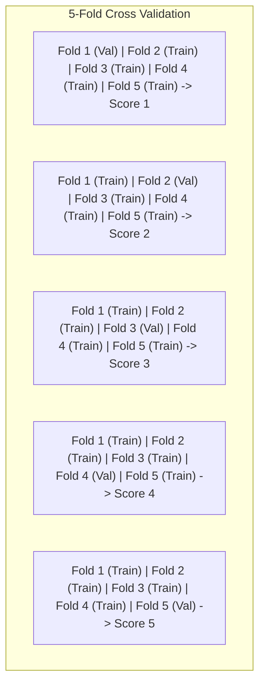

---
tags:
  - machine-learning/concept
  - validation
  - status/complete
aliases:
  - Cross-Validation
  - Train Test Split
  - K-Fold
  - Stratified K-Fold
type: concept
difficulty: Beginner
prerequisites:
  - "[[Evaluation Metrics for ML]]"
created: 2026-08-17
---

# 🔄 Cross-Validation & Data Splitting Strategies

> [!summary] **Core Intuition**
> To measure how well a model will perform on **unseen real-world data**, we simulate the future by holding out portions of our training dataset. **Cross-Validation** ensures every sample gets used for both training and validation, giving a low-variance estimate of model generalization.

---

## 🎯 The Golden Rule of ML Evaluation

```
+-------------------------------------------------------------------------------+
|                               FULL DATASET                                    |
+-------------------------------------------------------+-----------------------+
|                 DEVELOPMENT SET (80%)                 |    TEST SET (20%)     |
|   (Used for Feature Eng, Training & Hyperparam Tuning)| (LOCKED IN A VAULT!)  |
+---------------------------+---------------------------+-----------------------+
|      Train Fold (60%)     |    Validation Fold (20%)  | Evaluated ONLY ONCE at|
| (Model learns parameters) |  (Tune hyperparameters)   | the very end!         |
+---------------------------+---------------------------+-----------------------+
```

> [!danger] **Never Touch the Test Set During Modeling!**
> If you make any modeling decision based on the test set score (like choosing features, tuning $\lambda$, or picking an architecture), you have contaminated your test set with **data leakage**. The test score is no longer unbiased.

---

## 🧭 Cross-Validation Strategies

### 1. Standard $K$-Fold Cross-Validation
1. Partition the development data into $K$ equal subsets (folds), typically $K=5$ or $K=10$.
2. Train model on $K-1$ folds, evaluate on the held-out $k$-th fold.
3. Repeat $K$ times so every fold acts as the validation set once.
4. Report: $\text{Mean Score} \pm \text{Std Dev}$.



---

### 2. Stratified $K$-Fold (For Imbalanced Classification)
- Preserves the exact class percentage ratio in every single fold.
- If your dataset is 90% Class 0 and 10% Class 1, each train and validation fold is guaranteed to contain 90% Class 0 and 10% Class 1.

---

### 3. Time-Series Split (Walk-Forward Validation)
- For temporal / financial data, standard random shuffling causes **future-to-past data leakage** (predicting yesterday using tomorrow's stock price).
- **Rule**: Training data must strictly precede validation data in time.

```
Split 1: [Train: Month 1-3]  -> [Val: Month 4]
Split 2: [Train: Month 1-4]  -> [Val: Month 5]
Split 3: [Train: Month 1-5]  -> [Val: Month 6]
```

---

### 4. Group $K$-Fold (Group / Patient / User Clustering)
- If you have multiple medical scans from the same patient, samples from that patient must NOT be split across train and validation folds.
- **Rule**: Entire groups/patients remain strictly in train OR validation.

---

## 💻 Python Implementation (Scikit-Learn Pipeline)

```python
from sklearn.datasets import load_breast_cancer
from sklearn.model_selection import StratifiedKFold, cross_val_score
from sklearn.preprocessing import StandardScaler
from sklearn.linear_model import LogisticRegression
from sklearn.pipeline import make_pipeline

X, y = load_breast_cancer(return_X_y=True)

# Correct way: Embed scaler INSIDE pipeline so it fits only on training folds
pipeline = make_pipeline(StandardScaler(), LogisticRegression(max_iter=1000))

cv = StratifiedKFold(n_splits=5, shuffle=True, random_state=42)
scores = cross_val_score(pipeline, X, y, cv=cv, scoring='roc_auc')

print(f"5-Fold ROC-AUC Scores: {scores.round(4)}")
print(f"Mean ROC-AUC: {scores.mean():.4f} (± {scores.std():.4f})")
```

---

## 🔗 Related Notes & Graph Connections
- **Connected Concepts**:
  - [[Evaluation Metrics for ML]]
  - [[Data Leakage & How to Avoid It]]
  - [[Hyperparameter Tuning]]
- **Parent Hub**: [[Machine Learning MOC]]
