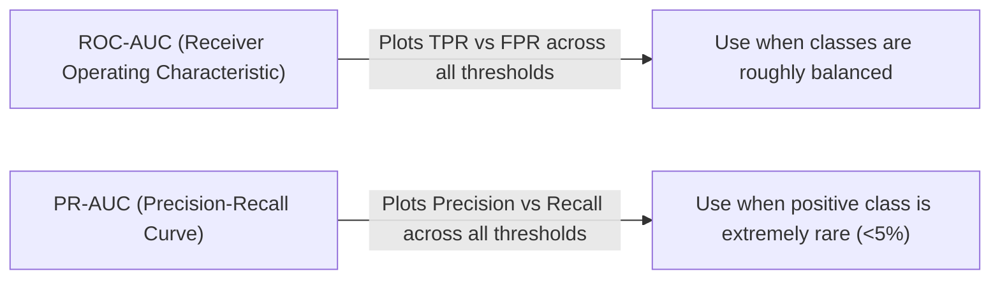

---
tags:
  - machine-learning/concept
  - evaluation
  - metrics
  - status/complete
aliases:
  - Evaluation Metrics
  - Classification Metrics
  - Regression Metrics
  - ROC-AUC
type: concept
difficulty: Beginner
prerequisites: []
created: 2026-08-17
---

# 📊 Evaluation Metrics for Machine Learning

> [!summary] **Core Intuition**
> You cannot improve what you cannot measure. Different real-world problems prioritize different types of errors. For cancer screening, a false negative is deadly; for spam detection, a false positive is annoying. Choosing the right metric aligns model optimization with business impact.

---

## 🏷️ 1. Classification Metrics

```
                     Actual Positive (1)        Actual Negative (0)
                +--------------------------+--------------------------+
Predicted (1)   |   True Positive (TP)     |   False Positive (FP)    |  <-- Type I Error
                +--------------------------+--------------------------+
Predicted (0)   |   False Negative (FN)    |   True Negative (TN)     |  <-- Type II Error
                +--------------------------+--------------------------+
```

### 🔹 Core Rate Definitions
- **Accuracy**: Fraction of all correct predictions:
  $$\text{Accuracy} = \frac{TP + TN}{TP + TN + FP + FN}$$
  > [!warning] **The Accuracy Paradox**
  > If 99% of transactions are legitimate and 1% are fraud, a dumb model that predicts "Not Fraud" for everything gets 99% accuracy while catching 0 fraud! **Never use raw accuracy on imbalanced data.**

- **Precision (Exactness)**: When the model predicts Positive, how often is it right?
  $$\text{Precision} = \frac{TP}{TP + FP}$$
  *Focus on Precision when False Positives are expensive* (e.g., spam filter moving important emails to junk).

- **Recall / Sensitivity (Completeness)**: What fraction of actual positives did the model find?
  $$\text{Recall} = \frac{TP}{TP + FN}$$
  *Focus on Recall when False Negatives are catastrophic* (e.g., cancer detection, fraud detection).

- **$F_1$ Score**: Harmonic mean of Precision and Recall:
  $$F_1 = 2 \cdot \frac{\text{Precision} \cdot \text{Recall}}{\text{Precision} + \text{Recall}} = \frac{2TP}{2TP + FP + FN}$$

- **$F_\beta$ Score**: Weighted harmonic mean prioritizing Recall ($\beta > 1$) or Precision ($\beta < 1$):
  $$F_\beta = (1 + \beta^2) \frac{\text{Precision} \cdot \text{Recall}}{\beta^2 \text{Precision} + \text{Recall}}$$

---

### 🔹 ROC-AUC vs PR-AUC



- **ROC Curve**: Plots $\text{True Positive Rate} = \frac{TP}{TP+FN}$ against $\text{False Positive Rate} = \frac{FP}{FP+TN}$.
  - $\text{AUC} = 0.5 \implies$ random guessing.
  - $\text{AUC} = 1.0 \implies$ perfect discrimination.

---

## 📈 2. Regression Metrics

| Metric | Formula | Scale / Units | Sensitivity to Outliers |
| :--- | :--- | :--- | :--- |
| **MAE (Mean Absolute Error)** | $\frac{1}{n} \sum \|y_i - \hat{y}_i\|$ | Same as target $y$ | 🟢 Low (Robust) |
| **MSE (Mean Squared Error)** | $\frac{1}{n} \sum (y_i - \hat{y}_i)^2$ | Squared units ($y^2$) | 🔴 High |
| **RMSE (Root MSE)** | $\sqrt{\text{MSE}}$ | Same as target $y$ | 🔴 High (Penalizes big mistakes) |
| **$R^2$ (Coefficient of Determination)** | $1 - \frac{\sum (y_i - \hat{y}_i)^2}{\sum (y_i - \bar{y})^2}$ | $[-\infty, 1.0]$ | Relative measure (% variance explained) |
| **Adjusted $R^2$** | $1 - (1 - R^2)\frac{n-1}{n-p-1}$ | Penalizes useless features | Essential for feature selection |

- **$R^2 = 1.0$**: Model explains 100% of the variance.
- **$R^2 = 0.0$**: Model performs no better than predicting the mean $\bar{y}$.
- **$R^2 < 0.0$**: Model is worse than predicting the horizontal mean line.

---

## 💻 Python Implementation (Scikit-Learn)

```python
import numpy as np
from sklearn.metrics import (
    classification_report, roc_auc_score,
    mean_squared_error, mean_absolute_error, r2_score
)

# 1. Classification Metrics
y_true_clf = np.array([1, 0, 1, 1, 0, 1, 0, 0, 1, 0])
y_prob_clf = np.array([0.9, 0.2, 0.8, 0.4, 0.1, 0.85, 0.7, 0.3, 0.95, 0.05])
y_pred_clf = (y_prob_clf >= 0.5).astype(int)

print("Classification Report:")
print(classification_report(y_true_clf, y_pred_clf))
print(f"ROC-AUC: {roc_auc_score(y_true_clf, y_prob_clf):.4f}")

# 2. Regression Metrics
y_true_reg = np.array([100.0, 150.0, 200.0, 250.0])
y_pred_reg = np.array([110.0, 140.0, 210.0, 240.0])

print(f"\nMAE:  {mean_absolute_error(y_true_reg, y_pred_reg):.2f}")
print(f"RMSE: {np.sqrt(mean_squared_error(y_true_reg, y_pred_reg)):.2f}")
print(f"R²:   {r2_score(y_true_reg, y_pred_reg):.4f}")
```

---

## 🔗 Related Notes & Graph Connections
- **Connected Concepts**:
  - [[Loss Functions & Cost Functions]]
  - [[Cross-Validation & Data Splits]]
  - [[Supervised Learning MOC]]
- **Parent Hub**: [[Machine Learning MOC]]
