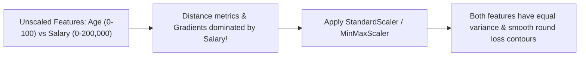

---
tags:
  - machine-learning/concept
  - preprocessing
  - status/complete
aliases:
  - Feature Engineering
  - Feature Scaling
  - Data Preprocessing
  - One-Hot Encoding
type: concept
difficulty: Beginner
prerequisites: []
created: 2026-08-17
---

# 🛠️ Feature Engineering & Scaling

> [!summary] **Core Intuition**
> "Coming up with features is difficult, time-consuming, requires expert knowledge. 'Applied machine learning' is basically feature engineering." — Andrew Ng.
> Raw real-world data is messy, unscaled, and categorical. Feature engineering transforms raw inputs into representations that algorithms can learn from efficiently.

---

## 🧭 Why Feature Scaling Matters



### 🔹 Model Sensitivity to Feature Scale
- **Extremely Sensitive (Scaling Required)**:
  - Distance-based: [[k-Nearest Neighbors (KNN)]], [[K-Means & K-Means++]], [[Principal Component Analysis (PCA)]].
  - Gradient-based: [[Logistic Regression]], [[Linear Regression]] with regularization, Neural Networks.
  - Margin-based: [[Support Vector Machines (SVM)]].
- **Scale-Invariant (Scaling Unnecessary)**:
  - Tree-based: [[Decision Trees]], [[Random Forests]], [[Gradient Boosting & XGBoost]].

---

## 📐 1. Numeric Feature Scaling Techniques

| Technique | Formula | Output Range | Outlier Robustness | Best Used For |
| :--- | :--- | :--- | :--- | :--- |
| **StandardScaler (Z-score)** | $z = \frac{x - \mu}{\sigma}$ | $\mu=0, \sigma=1$ (Unbounded) | 🟠 Moderate | Gaussian features; linear models & neural nets |
| **MinMaxScaler** | $x_{\text{scaled}} = \frac{x - x_{\min}}{x_{\max} - x_{\min}}$ | $[0, 1]$ | 🔴 Poor (Outliers compress normal points) | Image pixels ($0-255 \rightarrow 0-1$); bounded inputs |
| **RobustScaler** | $x_{\text{scaled}} = \frac{x - Q_2}{Q_3 - Q_1}$ | Centered at median ($IQR=1$) | 🟢 **High (Immune to outliers)** | Financial / transaction data with extreme outliers |
| **Log Transform** | $x' = \log(1 + x)$ | Compresses long right tails | 🟢 High | Highly skewed features (income, house prices) |

---

## 🏷️ 2. Categorical Encoding Strategies

```
Nominal (No Order: Red, Green, Blue)       --> One-Hot Encoding (pd.get_dummies / OneHotEncoder)
Ordinal (Natural Order: Low, Med, High)   --> Ordinal / Integer Encoding (1, 2, 3)
High Cardinality (Zip codes, 500+ Cities)  --> Target Encoding / Frequency Encoding / Embeddings
```

### A. One-Hot Encoding
Converts a categorical column with $C$ unique values into $C$ binary indicator columns ($0$ or $1$).
> [!tip] **The Dummy Variable Trap**
> For linear models without regularization, drop one column ($C-1$) to prevent perfect multicollinearity ($\sum \text{columns} = 1$).

### B. Target Encoding
Replaces each category with the average target value $y$ for that category:
$$\text{Encoded}(c) = \mathbb{E}[y \mid \text{category} = c]$$
> [!warning] **Target Leakage Danger**
> Always apply smoothing / out-of-fold target encoding to prevent severe overfitting on small categories!

---

## 💻 Python Implementation (Scikit-Learn ColumnTransformer)

```python
import numpy as np
import pandas as pd
from sklearn.compose import ColumnTransformer
from sklearn.preprocessing import StandardScaler, OneHotEncoder, RobustScaler
from sklearn.impute import SimpleImputer
from sklearn.pipeline import Pipeline

# Sample DataFrame
df = pd.DataFrame({
    'age': [25, 30, 45, np.nan, 22],
    'income': [50000, 60000, 120000, 80000, 2000000], # Notice extreme outlier
    'city': ['New York', 'Paris', 'London', 'New York', 'Paris'],
    'tier': ['Bronze', 'Silver', 'Gold', 'Silver', 'Platinum']
})

num_normal_cols = ['age']
num_skewed_cols = ['income']
cat_cols = ['city', 'tier']

# Modern production preprocessing pipeline
preprocessor = ColumnTransformer(transformers=[
    ('normal_num', Pipeline([
        ('imputer', SimpleImputer(strategy='median')),
        ('scaler', StandardScaler())
    ]), num_normal_cols),
    
    ('skewed_num', Pipeline([
        ('imputer', SimpleImputer(strategy='median')),
        ('robust_scaler', RobustScaler())
    ]), num_skewed_cols),
    
    ('cat', OneHotEncoder(handle_unknown='ignore', sparse_output=False), cat_cols)
])

processed_matrix = preprocessor.fit_transform(df)
print(f"Processed Feature Matrix Shape: {processed_matrix.shape}")
```

---

## 🔗 Related Notes & Graph Connections
- **Connected Concepts**:
  - [[Cross-Validation & Data Splits]]
  - [[Data Leakage & How to Avoid It]]
  - [[End-to-End ML Project Checklist]]
- **Parent Hub**: [[Machine Learning MOC]]
