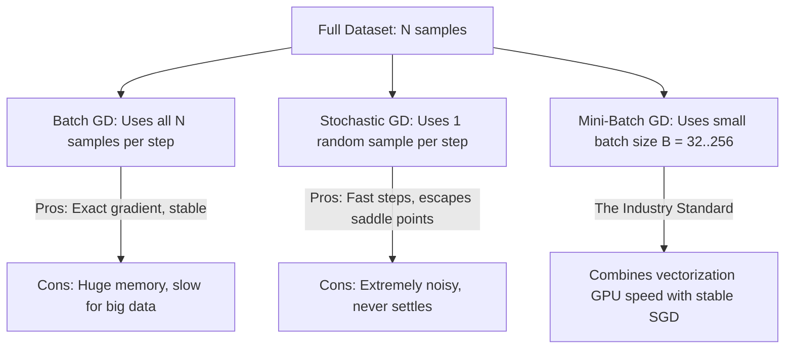

---
tags:
  - machine-learning/concept
  - optimization
  - status/complete
aliases:
  - Gradient Descent
  - Optimizers
  - SGD
  - Adam
type: concept
difficulty: Intermediate
prerequisites:
  - "[[Multivariate Calculus & Gradients]]"
  - "[[Loss Functions & Cost Functions]]"
created: 2026-08-17
---

# ⚡️ Gradient Descent & Modern Optimizers

> [!summary] **Core Intuition**
> Optimization is the engine room of machine learning. **Gradient Descent** updates model parameters in the direction opposite the gradient of the loss surface. Modern optimizers (like **Momentum** and **Adam**) accelerate convergence across ravines, smooth noisy gradients, and adapt learning rates dynamically per parameter.

---

## 🧭 The 3 Flavors of Gradient Descent



| Type | Batch Size ($B$) | Computational Cost / Step | Gradient Stability | GPU Vectorization Efficiency |
| :--- | :--- | :--- | :--- | :--- |
| **Batch GD** | $N$ (Entire dataset) | High ($O(N \cdot d)$) | ⭐️⭐️⭐️⭐️⭐️ Exact | Moderate |
| **Stochastic GD (SGD)** | $1$ | Low ($O(d)$) | ⭐️ Noisy / High Variance | ❌ Poor |
| **Mini-Batch GD** | $32 \sim 512$ | Balanced ($O(B \cdot d)$) | ⭐️⭐️⭐️⭐️ Smooth | ⭐️⭐️⭐️⭐️⭐️ Peak GPU Utilization |

---

## 📐 Mathematical Evolution of Optimizers

### 1. Vanilla Gradient Descent
$$
\mathbf{w}_{t+1} = \mathbf{w}_t - \eta \, \nabla_{\mathbf{w}} \mathcal{L}(\mathbf{w}_t)
$$
- $\eta$: Learning rate.
  - Too small: Crawls forever $\rightarrow$ gets stuck in flat regions.
  - Too large: Overshoots valleys and diverges ($\text{Loss} \rightarrow \infty$).

---

### 2. SGD with Momentum (The Heavy Ball Analogy)
Adds a velocity vector $\mathbf{v}_t$ with momentum coefficient $\beta \approx 0.9$:

> [!math] **Momentum Formulation**
> $$
> \begin{aligned}
> \mathbf{v}_t &= \beta \, \mathbf{v}_{t-1} + (1 - \beta) \, \nabla \mathcal{L}(\mathbf{w}_t) \\
> \mathbf{w}_{t+1} &= \mathbf{w}_t - \eta \, \mathbf{v}_t
> \end{aligned}
> $$

- **Why it works**: Cancels out high-frequency zig-zag oscillations along steep canyon walls while accumulating velocity in the flat direction toward the global minimum.

---

### 3. RMSProp (Root Mean Square Propagation)
Maintains an exponential moving average of **squared gradients** $\mathbf{s}_t$ to scale individual parameter step sizes:

$$
\begin{aligned}
\mathbf{s}_t &= \beta_2 \, \mathbf{s}_{t-1} + (1 - \beta_2) \, (\nabla \mathcal{L}(\mathbf{w}_t))^2 \\
\mathbf{w}_{t+1} &= \mathbf{w}_t - \frac{\eta}{\sqrt{\mathbf{s}_t} + \epsilon} \odot \nabla \mathcal{L}(\mathbf{w}_t)
\end{aligned}
$$
- **Effect**: Parameters with historically large gradients take smaller, safer steps; parameters with sparse, tiny gradients take larger steps.

---

### 4. Adam (Adaptive Moment Estimation)
Combines **Momentum** (1st moment $m_t$) and **RMSProp** (2nd moment $v_t$) with **bias corrections**:

> [!math] **The Complete Adam Algorithm**
> $$
> \begin{aligned}
> \mathbf{m}_t &= \beta_1 \mathbf{m}_{t-1} + (1 - \beta_1) \mathbf{g}_t \quad &(\text{1st Moment: Velocity}) \\
> \mathbf{v}_t &= \beta_2 \mathbf{v}_{t-1} + (1 - \beta_2) \mathbf{g}_t^2 \quad &(\text{2nd Moment: Variance}) \\
> \mathbf{\hat{m}}_t &= \frac{\mathbf{m}_t}{1 - \beta_1^t}, \quad \mathbf{\hat{v}}_t = \frac{\mathbf{v}_t}{1 - \beta_2^t} \quad &(\text{Bias Correction for early steps}) \\
> \mathbf{w}_{t+1} &= \mathbf{w}_t - \frac{\eta}{\sqrt{\mathbf{\hat{v}}_t} + \epsilon} \odot \mathbf{\hat{m}}_t
> \end{aligned}
> $$
> Standard default hyperparameters: $\eta = 10^{-3}, \beta_1 = 0.9, \beta_2 = 0.999, \epsilon = 10^{-8}$.

---

## 💻 Python Implementation (Adam from Scratch)

```python
import numpy as np

class AdamOptimizer:
    def __init__(self, lr=0.01, beta1=0.9, beta2=0.999, eps=1e-8):
        self.lr = lr
        self.beta1 = beta1
        self.beta2 = beta2
        self.eps = eps
        self.m = None
        self.v = None
        self.t = 0
        
    def step(self, w, grad):
        if self.m is None:
            self.m = np.zeros_like(w)
            self.v = np.zeros_like(w)
            
        self.t += 1
        # Update biased 1st and 2nd moment estimates
        self.m = self.beta1 * self.m + (1 - self.beta1) * grad
        self.v = self.beta2 * self.v + (1 - self.beta2) * (grad ** 2)
        
        # Compute bias-corrected moments
        m_hat = self.m / (1 - self.beta1 ** self.t)
        v_hat = self.v / (1 - self.beta2 ** self.t)
        
        # Update weights
        w_updated = w - self.lr * m_hat / (np.sqrt(v_hat) + self.eps)
        return w_updated

# Quick test on 2D Rosenbrock function
opt = AdamOptimizer(lr=0.05)
w = np.array([5.0, -3.0])
for step in range(5):
    # Dummy gradient
    grad = 2 * w
    w = opt.step(w, grad)
    print(f"Step {step+1}: w = {w.round(4)}")
```

---

## 🔗 Related Notes & Graph Connections
- **Underlying Math**: [[Multivariate Calculus & Gradients]]
- **Loss Landscapes**: [[Loss Functions & Cost Functions]]
- **Applied In**:
  - [[Linear Regression]] & [[Logistic Regression]]
  - [[Backpropagation & Computation Graphs]]
  - [[Deep Learning MOC]]
- **Parent Hub**: [[Machine Learning MOC]]
