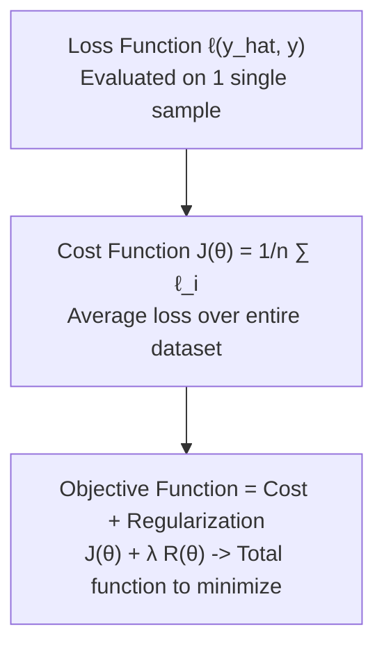

---
tags:
  - machine-learning/concept
  - status/complete
aliases:
  - Loss Functions
  - Cost Functions
  - Objective Functions
type: concept
difficulty: Intermediate
prerequisites:
  - "[[Multivariate Calculus & Gradients]]"
  - "[[Information Theory Basics]]"
created: 2026-08-17
---

# 🎯 Loss Functions & Cost Functions in Machine Learning

> [!summary] **Core Intuition**
> A **Loss Function** $\ell(\hat{y}, y)$ quantifies how wrong a model's prediction is for a **single sample**. A **Cost Function** $J(\mathbf{\theta})$ (or Empirical Risk) averages this loss over the **entire training dataset**, providing the numerical terrain that optimizers navigate to find the best weights.

---

## 🧭 Loss vs Cost vs Objective Function



---

## 📈 1. Regression Loss Functions (Continuous Targets)

| Loss Function | Formula $\ell(\hat{y}, y)$ | Derivative $\frac{\partial \ell}{\partial \hat{y}}$ | Outlier Sensitivity | Best Used When |
| :--- | :--- | :--- | :--- | :--- |
| **Mean Squared Error (MSE / $L_2$ Loss)** | $\frac{1}{2}(y - \hat{y})^2$ | $- (y - \hat{y})$ | 🔴 **High** (quadratic penalty) | Residuals are normally distributed; standard baseline |
| **Mean Absolute Error (MAE / $L_1$ Loss)** | $\|y - \hat{y}\|$ | $-\text{sign}(y - \hat{y})$ | 🟢 **Low (Robust)** | Data has extreme outliers / corrupt targets |
| **Huber Loss** | $\begin{cases} \frac{1}{2}(y-\hat{y})^2 & \text{if } \|y-\hat{y}\| \le \delta \\ \delta(\|y-\hat{y}\| - \frac{1}{2}\delta) & \text{otherwise} \end{cases}$ | $\begin{cases} -(y-\hat{y}) \\ -\delta \cdot \text{sign}(y-\hat{y}) \end{cases}$ | 🟢 **Robust & Smooth** | Combines MSE smooth convergence with MAE outlier robustness |

```
Loss
  ^
  |      MSE (Quadratic: penalizes large errors harshly)
  |   \       /
  |    \ MAE /  (Linear: constant gradient)
  |     \ v /
  |      \ /
  +-------+-------> Error (y - y_hat)
         0
```

---

## 🏷️ 2. Classification Loss Functions (Discrete Targets)

### A. Binary Cross-Entropy (Log-Loss)
For binary labels $y \in \{0, 1\}$ and predicted probability $\hat{p} = \sigma(\mathbf{w}^T \mathbf{x}) \in [0, 1]$:

> [!math] **Binary Cross-Entropy (BCE)**
> $$
> \ell_{\text{BCE}}(\hat{p}, y) = - \left[ y \log(\hat{p}) + (1 - y) \log(1 - \hat{p}) \right]
> $$

- **Behavior**:
  - If true $y = 1$ and $\hat{p} \rightarrow 1 \implies \text{Loss} \rightarrow 0$.
  - If true $y = 1$ and $\hat{p} \rightarrow 0 \implies \text{Loss} \rightarrow +\infty$ (infinitely penalizes confident mistakes).

---

### B. Categorical Cross-Entropy (Multi-Class)
For $K$ mutually exclusive classes with one-hot encoded vector $\mathbf{y}$ and Softmax probabilities $\mathbf{\hat{p}}$:

> [!math] **Categorical Cross-Entropy**
> $$
> \mathcal{L}_{\text{CCE}}(\mathbf{\hat{p}}, \mathbf{y}) = - \sum_{k=1}^K y_k \log(\hat{p}_k) = - \log(\hat{p}_{\text{true\_class}})
> $$

---

### C. Hinge Loss (Margin-Based)
Used in [[Support Vector Machines (SVM)]] for targets $y \in \{-1, +1\}$:

> [!math] **Hinge Loss**
> $$
> \ell_{\text{Hinge}}(\hat{y}, y) = \max(0, 1 - y \cdot \hat{y})
> $$

- **Zero Loss Zone**: If $y \cdot \hat{y} \ge 1$, prediction is correct AND outside the safety margin $\implies$ loss is 0.
- Only points on or inside the margin (or misclassified) contribute to the gradient (the **Support Vectors**).

---

## 💻 Python Implementation (NumPy)

```python
import numpy as np

# 1. Regression Losses
def mse_loss(y_true, y_pred):
    return np.mean((y_true - y_pred) ** 2)

def mae_loss(y_true, y_pred):
    return np.mean(np.abs(y_true - y_pred))

def huber_loss(y_true, y_pred, delta=1.0):
    err = np.abs(y_true - y_pred)
    is_small_error = err <= delta
    squared_loss = 0.5 * (err ** 2)
    linear_loss = delta * (err - 0.5 * delta)
    return np.mean(np.where(is_small_error, squared_loss, linear_loss))

# 2. Binary Cross-Entropy
def binary_cross_entropy(y_true, p_pred):
    p_pred = np.clip(p_pred, 1e-15, 1 - 1e-15)
    return -np.mean(y_true * np.log(p_pred) + (1 - y_true) * np.log(1 - p_pred))

# Quick verification
y_t = np.array([1, 0, 1, 1])
p_p = np.array([0.9, 0.1, 0.8, 0.35])
print(f"BCE Loss: {binary_cross_entropy(y_t, p_p):.4f}")
```

---

## 🔗 Related Notes & Graph Connections
- **Foundations**: [[Multivariate Calculus & Gradients]], [[Information Theory Basics]]
- **Downstream Models**:
  - [[Linear Regression]] (MSE / OLS)
  - [[Logistic Regression]] (BCE)
  - [[Support Vector Machines (SVM)]] (Hinge Loss)
  - [[Gradient Descent & Optimizers]] (How to minimize these losses)
- **Parent Hub**: [[Machine Learning MOC]]
