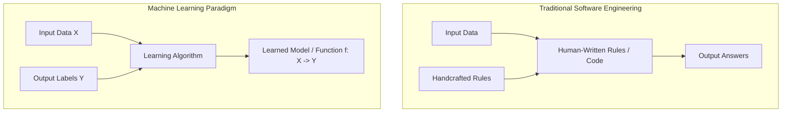
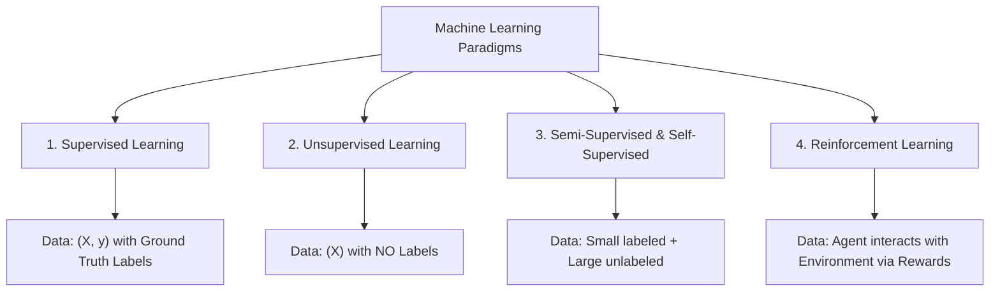

---
tags:
  - machine-learning/concept
  - status/complete
aliases:
  - ML Paradigms
  - Machine Learning Types
  - Supervised vs Unsupervised
type: concept
difficulty: Beginner
prerequisites: []
created: 2026-08-17
---

# 🌐 Machine Learning Paradigms

> [!summary] **Core Intuition**
> Machine learning systems learn patterns from data rather than relying on hand-crafted rules. Depending on the type of supervision available during training, machine learning is broadly divided into **Supervised**, **Unsupervised**, **Semi-Supervised**, and **Reinforcement Learning**.

---

## 🎯 The Fundamental Shift: Rules vs Data

In [[Traditional Programming VS Machine Learning]]:
- **Traditional Programming**: $\text{Input Data} + \text{Explicit Rules} \longrightarrow \text{Outputs}$
- **Machine Learning**: $\text{Input Data} + \text{Observed Outputs} \longrightarrow \text{Learned Model / Rules}$

---

## 🧭 The 4 Major Learning Paradigms

---

### 1. Supervised Learning (Learning with a Teacher)
- **Data**: Paired feature vectors and target labels: $\mathcal{D} = \{(\mathbf{x}_i, y_i)\}_{i=1}^n$.
- **Goal**: Find $f(\mathbf{x}) \approx y$ such that generalization error on unseen data is minimized.
- **Two Core Tasks**:
  1. **Regression**: Target $y \in \mathbb{R}$ is continuous (e.g., house price, temperature).
     - Models: [[Linear Regression]], Random Forest Regressor, Gradient Boosting.
  2. **Classification**: Target $y \in \{C_1, C_2, \dots, C_k\}$ is discrete/categorical (e.g., spam vs non-spam).
     - Models: [[Logistic Regression]], [[Decision Trees]], [[Support Vector Machines (SVM)]], [[Naive Bayes]].
- **Hub**: [[Supervised Learning MOC]]

---

### 2. Unsupervised Learning (Discovering Latent Structure)
- **Data**: Feature vectors only: $\mathcal{D} = \{\mathbf{x}_i\}_{i=1}^n$ (no ground truth labels).
- **Goal**: Discover underlying distributions, geometric clusters, or compressed representations.
- **Core Tasks**:
  1. **Clustering**: Grouping similar instances together.
     - Models: [[K-Means & K-Means++]], [[Hierarchical Clustering]], [[DBSCAN]].
  2. **Dimensionality Reduction**: Projecting high-dimensional data to lower dimensions while preserving variance or neighbor topology.
     - Models: [[Principal Component Analysis (PCA)]], [[t-SNE & UMAP]].
  3. **Anomaly / Outlier Detection**: Flagging instances that deviate significantly from the norm.
     - Models: [[Anomaly Detection Techniques]] (Isolation Forest, LOF).
- **Hub**: [[Unsupervised Learning MOC]]

---

### 3. Semi-Supervised & Self-Supervised Learning
- **Semi-Supervised**: When labeling data is expensive (e.g., medical scans requiring radiologist time). Uses a small labeled dataset plus a large pool of cheap unlabeled data to improve decision boundaries.
- **Self-Supervised Learning (SSL)**: The foundation of modern LLMs (e.g., GPT, BERT) and Computer Vision foundation models:
  - Generates supervisory signals from the data itself (e.g., predicting the next word in a sentence or filling in masked image patches).

---

### 4. Reinforcement Learning (Trial & Error with Rewards)
- **Framework**: An **Agent** takes actions $a_t$ in an **Environment**, transitions to new states $s_{t+1}$, and receives scalar **Rewards** $r_t$.
- **Goal**: Learn a **Policy** $\pi(a \mid s)$ that maximizes cumulative discounted future reward:
  $$G_t = \sum_{k=0}^{\infty} \gamma^k r_{t+k+1}$$
- **Applications**: Robotics, game playing (AlphaGo, Atari), LLM alignment via RLHF (Reinforcement Learning from Human Feedback).

---

## ⚖️ Comparison Summary Table

| Paradigm | Data Requirement | Feedback Mechanism | Primary Evaluation Metric |
| :--- | :--- | :--- | :--- |
| **Supervised** | Features $\mathbf{X}$ + Labels $\mathbf{y}$ | Direct error compared to true labels | Accuracy, F1, MSE, ROC-AUC |
| **Unsupervised** | Features $\mathbf{X}$ only | Internal consistency / distance metrics | Silhouette Score, Inertia, Explained Variance |
| **Self-Supervised** | Raw uncurated data | Pretext task loss (cross-entropy on masks) | Downstream fine-tuning performance |
| **Reinforcement** | Environment states & rewards | Scalar rewards with temporal delays | Cumulative Return / Win Rate |

---

## 🔗 Related Notes & Graph Connections
- **Vault Foundation**: [[Traditional Programming VS Machine Learning]]
- **Next Deep Dives**:
  - [[Supervised Learning MOC]]
  - [[Unsupervised Learning MOC]]
  - [[Deep Learning MOC]]
  - [[Loss Functions & Cost Functions]]
- **Parent Hub**: [[Machine Learning MOC]]
