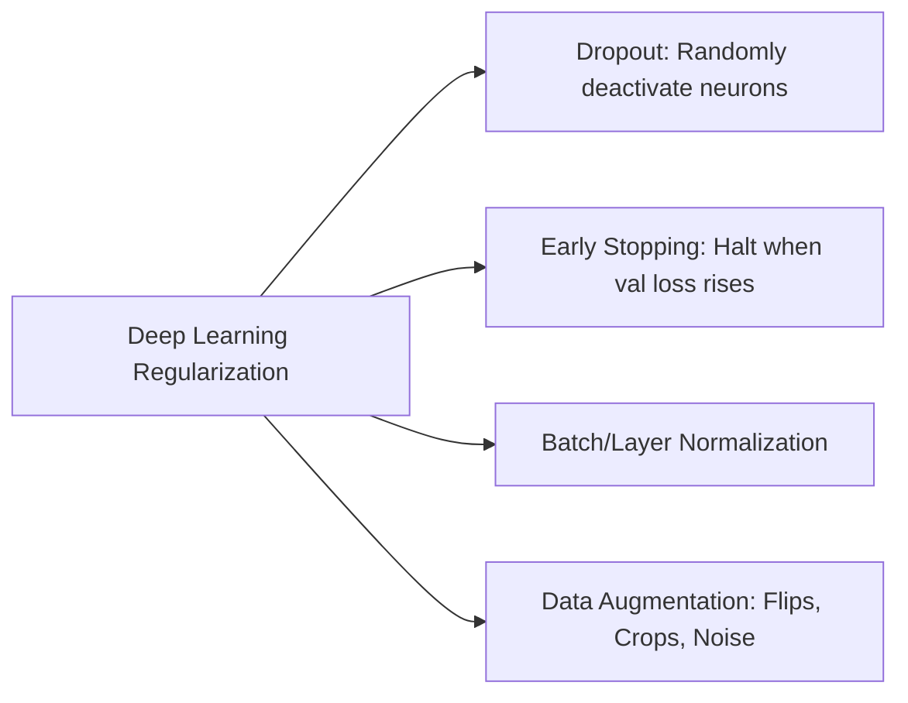

---
tags:
  - machine-learning/concept
  - regularization
  - status/complete
aliases:
  - Regularization
  - L1 and L2 Regularization
  - Ridge and Lasso
  - Dropout
type: concept
difficulty: Intermediate
prerequisites:
  - "[[Bias-Variance Tradeoff]]"
  - "[[Loss Functions & Cost Functions]]"
created: 2026-08-17
---

# 🛡️ Regularization Techniques in Machine Learning

> [!summary] **Core Intuition**
> **Regularization** discourages complex or extreme models by adding a penalty for complexity to the loss function:
> $$\text{Total Objective} = \text{Loss}(\text{Data}, \mathbf{w}) + \lambda \cdot \Omega(\mathbf{w})$$
> By constraining parameter magnitudes, regularization slightly increases bias while dramatically reducing **variance**, solving **overfitting**.

---

## 🧭 Geometric Comparison: $L_1$ (Lasso) vs $L_2$ (Ridge)

```
        L1 (Lasso) - Diamond Constraint              L2 (Ridge) - Circle Constraint
                     w2                                           w2
                     ^                                            ^
                     |                                            |
                   / | \                                      .-'""'-.
                 /   |   \                                  .'        '.
               /     |     \                               /            \
          ----+------+------+----> w1                ----+------+------+----> w1
               \     |     /                               \            /
                 \   |   /                                  '.        .'
                   \ | /                                      '-....-'
                     |                                            |
      * Corners lie EXACTLY on axes!             * Smooth contour: weights shrink
      -> Forces weights to become 0.0            -> Weights get tiny but rarely 0.0
      -> Automatic Feature Selection!            -> Stable against multicollinearity!
```

---

## 📐 Mathematical Formulation

### 1. $L_2$ Regularization (Ridge Regression / Weight Decay)
Penalizes the squared Euclidean ($L_2$) norm of weights:

> [!math] **$L_2$ Regularization**
> $$
> J_{L_2}(\mathbf{w}) = \mathcal{L}_{\text{MSE}}(\mathbf{w}) + \lambda \|\mathbf{w}\|_2^2 = \frac{1}{n} \sum_{i=1}^n (y_i - \mathbf{w}^T \mathbf{x}_i)^2 + \lambda \sum_{j=1}^d w_j^2
> $$

- **Closed-form Solution**:
  $$\mathbf{w}_{\text{Ridge}} = (\mathbf{X}^T \mathbf{X} + \lambda \mathbf{I})^{-1} \mathbf{X}^T \mathbf{y}$$
- **Key Benefit**: Adding $\lambda \mathbf{I}$ guarantees the matrix is invertible even with severe multicollinearity!

---

### 2. $L_1$ Regularization (Lasso Regression)
Penalizes the sum of absolute values of weights ($L_1$ norm):

> [!math] **$L_1$ Regularization**
> $$
> J_{L_1}(\mathbf{w}) = \mathcal{L}_{\text{MSE}}(\mathbf{w}) + \lambda \|\mathbf{w}\|_1 = \frac{1}{n} \sum_{i=1}^n (y_i - \mathbf{w}^T \mathbf{x}_i)^2 + \lambda \sum_{j=1}^d |w_j|
> $$

- **Key Benefit**: Drives non-informative feature weights to **exact zeros**, producing a sparse model that performs built-in feature selection.

---

### 3. Elastic Net (The Best of Both Worlds)
Combines $L_1$ and $L_2$ penalties with mixing parameter $\rho \in [0, 1]$:

$$
J_{\text{ElasticNet}}(\mathbf{w}) = \mathcal{L}(\mathbf{w}) + \lambda \left[ \rho \|\mathbf{w}\|_1 + \frac{1-\rho}{2} \|\mathbf{w}\|_2^2 \right]
$$
- Use when features are correlated in groups: Lasso arbitrarily picks one feature from a correlated group, while Elastic Net retains the entire group.

---

## 🧠 Deep Learning Regularization Techniques



1. **Dropout**: During training, randomly set a fraction $p$ (e.g., $p=0.5$) of neuron activations to 0. Forces neurons to learn redundant, robust features rather than co-adapting.
2. **Early Stopping**: Monitor validation loss at every epoch; save model weights and stop training when validation loss stops improving for $k$ epochs (*patience*).
3. **Data Augmentation**: Artificially expand the training dataset through rotations, jitter, cropping, or mixup.

---

## 💻 Python Implementation (Scikit-Learn)

```python
from sklearn.datasets import make_regression
from sklearn.linear_model import LinearRegression, Ridge, Lasso, ElasticNet
from sklearn.model_selection import train_test_split

# Generate data with 20 features, only 5 of which are truly informative
X, y = make_regression(n_samples=100, n_features=20, n_informative=5, noise=10, random_state=42)
X_train, X_test, y_train, y_test = train_test_split(X, y, test_size=0.3, random_state=42)

# Compare models
models = {
    "OLS (No Reg)": LinearRegression(),
    "Ridge (L2)": Ridge(alpha=10.0),
    "Lasso (L1)": Lasso(alpha=2.0),
    "ElasticNet": ElasticNet(alpha=2.0, l1_ratio=0.5)
}

for name, model in models.items():
    model.fit(X_train, y_train)
    zero_weights = (model.coef_ == 0).sum()
    r2_test = model.score(X_test, y_test)
    print(f"{name:14s} | Test R²: {r2_test:.4f} | Zeroed Features: {zero_weights:2d} / 20")
```

---

## 🔗 Related Notes & Graph Connections
- **Context**: [[Bias-Variance Tradeoff]]
- **Applied In**:
  - [[Linear Regression]] (Ridge, Lasso)
  - [[Logistic Regression]] (Penalty terms $C = 1/\lambda$)
  - [[Support Vector Machines (SVM)]] (Slack penalty $C$)
  - [[Deep Learning MOC]]
- **Parent Hub**: [[Machine Learning MOC]]
