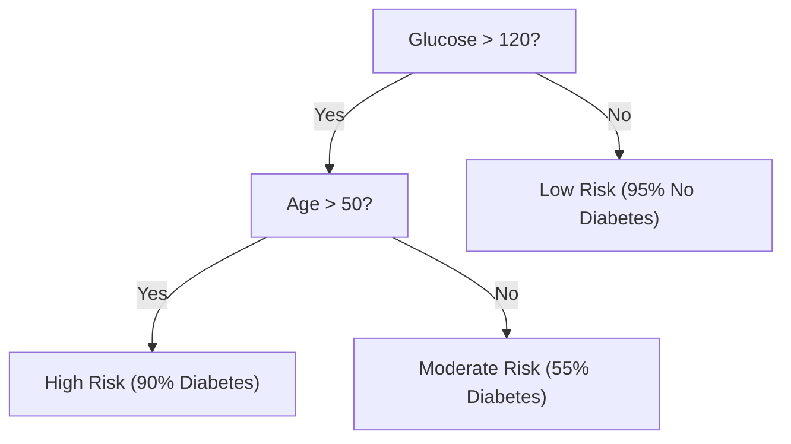

---
tags:
  - machine-learning/algorithm
  - supervised/tree-based
  - status/complete
aliases:
  - Decision Trees
  - CART
  - Gini Impurity
  - Information Gain
type: algorithm
paradigm: Supervised
task: Classification # and Regression
difficulty: Beginner
prerequisites:
  - "[[Information Theory Basics]]"
  - "[[Machine Learning Paradigms]]"
created: 2026-08-17
---

# 🌲 Decision Trees (CART)

> [!summary] **Algorithm at a Glance**
> **Goal**: Non-parametric supervised learning algorithm that predicts target values by learning simple, hierarchical **if-then decision rules** inferred from data features.  
> **Geometric Interpretation**: Partitions the input feature space into a set of orthogonal, axis-aligned hyper-rectangles.  
> **Key Splitting Metric**: Gini Impurity (CART default) or Information Gain (Entropy).

---

## 🎯 Intuition & Mental Model: The 20 Questions Game

Think of a Decision Tree as a game of 20 Questions:
At each node, the tree asks the single question that separates classes as cleanly as possible (e.g., *"Is Glucose > 120?"*).



---

## 📐 Mathematical Splitting Criteria

Let a node $m$ contain $N_m$ samples from $K$ classes, where $p_{mk}$ is the proportion of class $k$ samples in node $m$.

### 1. Gini Impurity (CART Default)
Measures the probability that a randomly chosen element would be incorrectly labeled if it were randomly labeled according to the distribution of labels in the subset:

> [!math] **Gini Impurity**
> $$
> I_G(m) = 1 - \sum_{k=1}^K p_{mk}^2
> $$
> - **Pure Node** (all samples belong to class 1): $I_G = 1 - (1.0)^2 = \mathbf{0.0}$.
> - **Maximum Impurity** (50/50 binary split): $I_G = 1 - (0.5^2 + 0.5^2) = \mathbf{0.50}$.

---

### 2. Entropy & Information Gain (ID3 / C4.5)
Measures uncertainty using Shannon Entropy (see [[Information Theory Basics]]):

> [!math] **Information Gain**
> $$
> H(m) = -\sum_{k=1}^K p_{mk} \log_2(p_{mk})
> $$
> $$
> \text{IG}(m, j, t) = H(m) - \left( \frac{N_{\text{left}}}{N_m} H(\text{left}) + \frac{N_{\text{right}}}{N_m} H(\text{right}) \right)
> $$

---

### 3. Regression Trees (Variance Reduction)
For continuous targets, the split minimizes the Mean Squared Error of the two child nodes:
$$
\text{Cost}(j, t) = \frac{1}{N_{\text{left}}} \sum_{i \in \text{left}} (y_i - \bar{y}_{\text{left}})^2 + \frac{1}{N_{\text{right}}} \sum_{i \in \text{right}} (y_i - \bar{y}_{\text{right}})^2
$$

---

## ⚙️ The CART Training Algorithm (Greedy Recursive Splitting)

1. **Scan all features** $j \in \{1, \dots, d\}$ and all possible split thresholds $t$.
2. **Find the pair $(j^*, t^*)$** that maximizes impurity reduction $\Delta I$.
3. **Split the node** into Left ($x_j \le t$) and Right ($x_j > t$) child subsets.
4. **Recurse** on both children until a stopping criterion is met:
   - Max depth reached (`max_depth`)
   - Node sample count is too small (`min_samples_split`)
   - Node is completely pure ($I_G = 0$)

---

## ⚖️ Strengths, Weaknesses & Hyperparameters

| Strengths (Pros) | Weaknesses (Cons) |
| :--- | :--- |
| • **White-box interpretability**: Can be visualized and explained to non-technical stakeholders<br>• **Scale-invariant**: No feature scaling or normalization required<br>• Naturally handles non-linear relationships and feature interactions | • **High Variance (Instability)**: Small changes in training data produce completely different trees<br>• **Prone to severe overfitting** if unconstrained<br>• Axis-aligned splits struggle with diagonal decision boundaries |

### 🛠️ Key Hyperparameters to Prevent Overfitting
- `max_depth`: Limits the maximum depth of the tree (e.g., 3 to 6).
- `min_samples_leaf`: Minimum number of samples required to be at a leaf node.
- `ccp_alpha`: Minimal Cost-Complexity Pruning parameter.

---

## 💻 Python Implementation (Scikit-Learn)

```python
from sklearn.datasets import load_iris
from sklearn.tree import DecisionTreeClassifier, export_text
from sklearn.model_selection import train_test_split

X, y = load_iris(return_X_y=True)
X_train, X_test, y_train, y_test = train_test_split(X, y, test_size=0.2, random_state=42)

# Constrained decision tree to prevent overfitting
tree_clf = DecisionTreeClassifier(max_depth=3, criterion='gini', random_state=42)
tree_clf.fit(X_train, y_train)

# Display text rules of the tree
rules = export_text(tree_clf, feature_names=load_iris().feature_names)
print(rules)
print(f"Test Accuracy: {tree_clf.score(X_test, y_test) * 100:.2f}%")
```

---

## 🔗 Related Notes & Graph Connections
- **Foundations**: [[Information Theory Basics]], [[Bias-Variance Tradeoff]]
- **Ensemble Extensions**:
  - [[Random Forests]] (Bagging ensemble of decision trees)
  - [[Gradient Boosting & XGBoost]] (Boosting ensemble of decision trees)
- **Parent Hub**: [[Supervised Learning MOC]]
