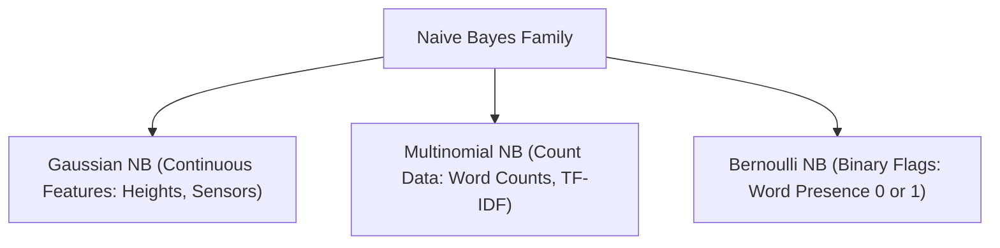

---
tags:
  - machine-learning/algorithm
  - supervised/probabilistic
  - status/complete
aliases:
  - Naive Bayes
  - GaussianNB
  - MultinomialNB
type: algorithm
paradigm: Supervised
task: Classification
difficulty: Beginner
prerequisites:
  - "[[Probability & Statistics for ML]]"
created: 2026-08-17
---

# 📜 Naive Bayes Classifiers

> [!summary] **Algorithm at a Glance**
> **Goal**: Generative probabilistic classifier based on **Bayes' Theorem**.  
> **The "Naive" Assumption**: Assumes that all input features $x_1, \dots, x_d$ are **mutually independent** given the class label $y$.  
> **Key Strength**: Blazing fast ($O(n \cdot d)$ training and inference), surprisingly effective for text classification and spam filtering with small data.

---

## 🎯 Intuition & The "Naive" Assumption

To classify an email as Spam or Not Spam based on words like *"Lottery"*, *"Free"*, *"Winner"*:
- **True Reality**: Words are correlated (*"Free"* and *"Winner"* often appear together).
- **Naive Bayes Assumption**: We pretend that knowing the email contains *"Free"* tells us *nothing* about whether it also contains *"Winner"*, conditional on knowing it is Spam.
- **Why do this?** Without this assumption, estimating full joint probabilities requires $O(2^d)$ parameters. With the independence assumption, we only need $O(d)$ parameters!

---

## 📐 Mathematical Formulation

Applying Bayes' Theorem:

$$
P(y = c \mid \mathbf{x}) = \frac{P(\mathbf{x} \mid y = c) \, P(y = c)}{P(\mathbf{x})} \propto P(y = c) \, P(\mathbf{x} \mid y = c)
$$

Under the conditional independence assumption:
$$
P(\mathbf{x} \mid y = c) = P(x_1, x_2, \dots, x_d \mid y = c) = \prod_{j=1}^d P(x_j \mid y = c)
$$

> [!math] **Log-Likelihood Decision Rule**
> To avoid floating-point underflow from multiplying many tiny probabilities, we take logarithms:
> $$
> \hat{y} = \arg\max_{c} \left[ \log P(y = c) + \sum_{j=1}^d \log P(x_j \mid y = c) \right]
> $$

---

## 🍦 The 3 Flavors of Naive Bayes



### 1. Gaussian Naive Bayes
Assumes continuous features follow a Normal distribution:
$$
P(x_j \mid y = c) = \frac{1}{\sqrt{2\pi \sigma_{jc}^2}} \exp\left( - \frac{(x_j - \mu_{jc})^2}{2\sigma_{jc}^2} \right)
$$

### 2. Multinomial Naive Bayes & Laplace Smoothing
For word counts in text documents:
$$
P(w_j \mid y = c) = \frac{N_{jc} + \alpha}{N_c + \alpha \cdot |V|}
$$
> [!tip] **Laplace Smoothing ($\alpha = 1$)**
> If an unseen word appears in a test email that never appeared in spam training data, $P(\text{word} \mid \text{Spam}) = 0$, which would zero out the entire product! Adding $\alpha = 1$ ensures no probability is ever zero.

---

## 💻 Python Implementation (Scikit-Learn NLP Pipeline)

```python
from sklearn.feature_extraction.text import CountVectorizer
from sklearn.naive_bayes import MultinomialNB
from sklearn.pipeline import make_pipeline

# Training text corpus
texts = [
    "Win real cash and free lottery prizes now",
    "Meeting rescheduled for tomorrow morning project discussion",
    "Claim your free coupon code right here",
    "Please find attached the quarterly earnings report"
]
labels = [1, 0, 1, 0] # 1: Spam, 0: Ham

# End-to-end spam filter pipeline
spam_filter = make_pipeline(CountVectorizer(), MultinomialNB(alpha=1.0))
spam_filter.fit(texts, labels)

# Test on new email
test_email = ["Urgent free prize waiting for you"]
pred = spam_filter.predict(test_email)
prob = spam_filter.predict_proba(test_email)

print(f"Prediction: {'SPAM' if pred[0] == 1 else 'HAM'} (Spam Probability: {prob[0][1] * 100:.2f}%)")
```

---

## 🔗 Related Notes & Graph Connections
- **Foundations**: [[Probability & Statistics for ML]], [[Information Theory Basics]]
- **Alternative Linear Classifier**: [[Logistic Regression]] (Discriminative vs Generative)
- **Parent Hub**: [[Supervised Learning MOC]]
