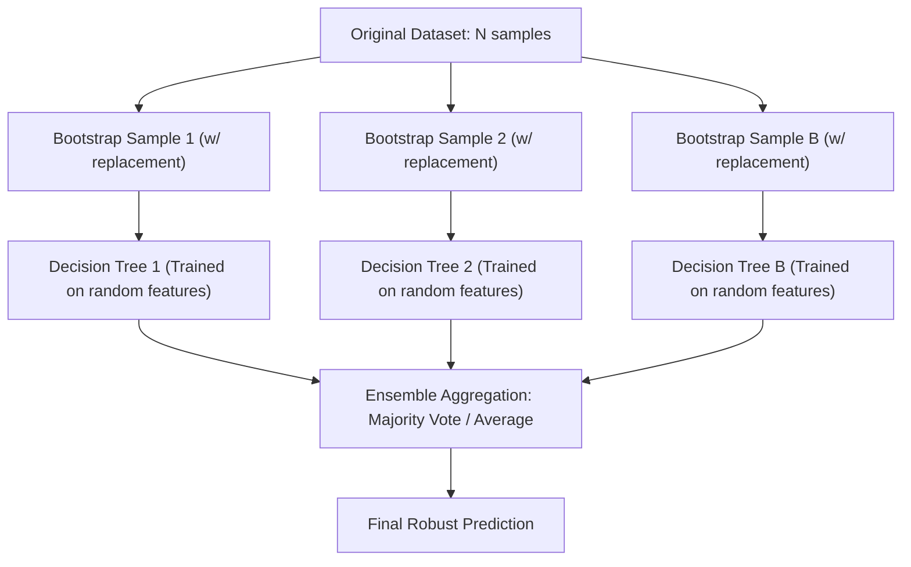

---
tags:
  - machine-learning/algorithm
  - supervised/ensemble
  - status/complete
aliases:
  - Random Forests
  - Bagging
  - Random Forest Classifier
type: algorithm
paradigm: Supervised
task: Classification # and Regression
difficulty: Intermediate
prerequisites:
  - "[[Decision Trees]]"
  - "[[Bias-Variance Tradeoff]]"
created: 2026-08-17
---

# 🌲🌲 Random Forests & Bootstrap Aggregation

> [!summary] **Algorithm at a Glance**
> **Goal**: An ensemble learning method that constructs a multitude of decorrelated [[Decision Trees]] during training and outputs the **majority vote** (classification) or **mean prediction** (regression) of the individual trees.  
> **Core Magic**: Drastically slashes the high variance of individual decision trees without sacrificing low bias.

---

## 🎯 Intuition: The Wisdom of Crowds

A single expert (one decision tree) might have strong biases or overfit to specific quirks in the data.  
If you assemble a diverse committee of 500 independent experts and average their votes:
- Individual idiosyncratic mistakes cancel each other out.
- The aggregate consensus is remarkably accurate and robust.



---

## 🎲 The 2 Pillars of Randomness

To make the ensemble effective, the individual trees **must be decorrelated**. Random Forests introduce two levels of stochasticity:

### 1. Row Randomness: Bootstrap Aggregation (Bagging)
- For each tree $b \in \{1, \dots, B\}$, draw a random sample of size $N$ **with replacement** from the training set.
- **Out-of-Bag (OOB) Samples**:
  - The probability of a sample NOT being picked in $N$ draws is $\lim_{N \to \infty} (1 - \frac{1}{N})^N = \frac{1}{e} \approx \mathbf{36.8\%}$.
  - These $\approx 37\%$ unseen samples form the **OOB dataset**, used to evaluate the model without needing a separate validation set!

### 2. Column Randomness: Random Subspace Method
- At **each split** in each tree, consider only a random subset of $m$ features instead of all $d$ features:
  - Classification: $m = \lfloor \sqrt{d} \rfloor$
  - Regression: $m = \lfloor d / 3 \rfloor$
- **Why this matters**: Prevents a single dominant feature from appearing at the top of every tree, ensuring true tree diversity ($\rho \rightarrow 0$).

---

## 📐 Mathematical Variance Reduction

For $B$ identically distributed trees with individual variance $\sigma^2$ and pairwise correlation $\rho$:

> [!math] **Ensemble Variance Formula**
> $$
> \text{Var}(\bar{T}) = \rho \sigma^2 + \frac{1 - \rho}{B} \sigma^2
> $$
> - As $B \rightarrow \infty$, the second term $\frac{1-\rho}{B}\sigma^2 \rightarrow 0$.
> - The remaining variance limit is $\rho \sigma^2$. By randomly subsetting features, Random Forests drive down correlation $\rho$, driving down total variance!

---

## 📊 Feature Importance Metrics

1. **Mean Decrease in Impurity (MDI / Gini Importance)**:
   - Sums the total impurity reduction across all splits where feature $j$ was used, averaged over all trees.
   - *Caution*: Biased toward continuous / high-cardinality features.
2. **Permutation Feature Importance**:
   - Randomly shuffles the values of feature $j$ in the validation set and measures the drop in model accuracy. Highly reliable and unbiased.

---

## 💻 Python Implementation (Scikit-Learn)

```python
from sklearn.datasets import load_wine
from sklearn.ensemble import RandomForestClassifier
from sklearn.model_selection import train_test_split
from sklearn.metrics import accuracy_score

X, y = load_wine(return_X_y=True)
X_train, X_test, y_train, y_test = train_test_split(X, y, test_size=0.2, random_state=42)

# Instantiate Random Forest with OOB scoring enabled
rf = RandomForestClassifier(
    n_estimators=100,
    max_features='sqrt',
    oob_score=True,
    random_state=42,
    n_jobs=-1 # Parallelize across all CPU cores
)

rf.fit(X_train, y_train)

print(f"OOB Evaluation Score: {rf.oob_score_ * 100:.2f}%")
print(f"Test Set Accuracy:   {rf.score(X_test, y_test) * 100:.2f}%")

# Top 3 most important features
importances = rf.feature_importances_
top_indices = importances.argsort()[::-1][:3]
for idx in top_indices:
    print(f"Feature '{load_wine().feature_names[idx]}': Importance = {importances[idx]:.4f}")
```

---

## 🔗 Related Notes & Graph Connections
- **Building Block**: [[Decision Trees]]
- **Alternative Ensemble Paradigm**: [[Gradient Boosting & XGBoost]] (Sequential boosting vs Parallel bagging)
- **Concept Deep Dive**: [[Bias-Variance Tradeoff]]
- **Parent Hub**: [[Supervised Learning MOC]]
