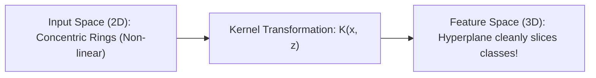

---
tags:
  - machine-learning/algorithm
  - supervised/classification
  - status/complete
aliases:
  - Support Vector Machines
  - SVM
  - SVC
  - Kernel Trick
  - RBF Kernel
type: algorithm
paradigm: Supervised
task: Classification # and Regression (SVR)
difficulty: Intermediate
prerequisites:
  - "[[Linear Algebra for ML]]"
  - "[[Multivariate Calculus & Gradients]]"
  - "[[Loss Functions & Cost Functions]]"
created: 2026-08-17
---

# ⚔️ Support Vector Machines (SVM) & The Kernel Trick

> [!summary] **Algorithm at a Glance**
> **Goal**: Find the optimal separating hyperplane that maximizes the **geometric margin** (distance) between two classes.  
> **Key Mechanism**: The decision boundary is determined solely by the critical borderline points called **Support Vectors**.  
> **Non-Linear Secret**: Uses the **Kernel Trick** to implicitly project data into infinite-dimensional spaces without ever computing coordinate transformations directly!

---

## 🎯 Intuition: Building the Widest Street

While [[Logistic Regression]] will accept *any* line that separates the two classes, SVM looks for the **widest possible street (maximum margin)** separating the classes:

```
        Class +1                  Class -1
          *                         o
             *    [ Margin = 2/||w|| ]
          *     * |                |   o
                 [+1]             [-1]
          ---------|-------|-------|---------  <-- Decision Hyperplane: w^T x + b = 0
                (SV)*      |      (SV)o
                           |         o
```

- Points touching the gutter lines are **Support Vectors**.
- Removing any non-support vector point changes nothing!

---

## 📐 Mathematical Formulation

### 1. Hard-Margin SVM (Linearly Separable Data)
Maximize margin $\gamma = \frac{1}{\|\mathbf{w}\|_2}$, which is equivalent to minimizing $\frac{1}{2}\|\mathbf{w}\|_2^2$:

> [!math] **Primal Hard-Margin Optimization**
> $$
> \min_{\mathbf{w}, b} \frac{1}{2} \|\mathbf{w}\|_2^2 \quad \text{subject to} \quad y_i (\mathbf{w}^T \mathbf{x}_i + b) \ge 1, \quad \forall i = 1, \dots, n
> $$

---

### 2. Soft-Margin SVM (Real-World Noisy Data with Slack $\xi_i$)
Allows some points to violate the margin with penalty parameter $C$:

> [!math] **Primal Soft-Margin (Hinge Loss + $L_2$ Regularization)**
> $$
> \min_{\mathbf{w}, b, \mathbf{\xi}} \frac{1}{2} \|\mathbf{w}\|_2^2 + C \sum_{i=1}^n \xi_i \quad \text{subject to} \quad y_i (\mathbf{w}^T \mathbf{x}_i + b) \ge 1 - \xi_i, \quad \xi_i \ge 0
> $$
> - **Large $C$**: Strict margin (low bias, high variance $\rightarrow$ prone to overfitting).
> - **Small $C$**: Wider margin, allows more violations (high bias, low variance).

---

### 3. The Dual Problem & Support Vectors
Using Lagrange multipliers $\alpha_i \ge 0$:

$$
\max_{\mathbf{\alpha}} \sum_{i=1}^n \alpha_i - \frac{1}{2} \sum_{i=1}^n \sum_{j=1}^n \alpha_i \alpha_j y_i y_j (\mathbf{x}_i^T \mathbf{x}_j) \quad \text{s.t.} \quad 0 \le \alpha_i \le C, \quad \sum \alpha_i y_i = 0
$$

- **Crucial Insight**: The optimization depends ONLY on the **dot product** $\mathbf{x}_i^T \mathbf{x}_j$ between pairs of points!
- The final decision function is:
  $$\hat{y}(\mathbf{x}) = \text{sign}\left( \sum_{i \in \text{Support Vectors}} \alpha_i y_i (\mathbf{x}_i^T \mathbf{x}) + b \right)$$

---

## 🔮 The Kernel Trick (Non-Linear Classification)

When data cannot be linearly separated in $2D$, project it into higher dimensions $\Phi(\mathbf{x})$ where it becomes linearly separable:



Instead of computing expensive high-dimensional coordinates $\Phi(\mathbf{x})$, compute a **Kernel Function** $K(\mathbf{x}_i, \mathbf{x}_j) = \langle \Phi(\mathbf{x}_i), \Phi(\mathbf{x}_j) \rangle$:

| Kernel Name | Formula $K(\mathbf{x}, \mathbf{z})$ | Use Case |
| :--- | :--- | :--- |
| **Linear** | $\mathbf{x}^T \mathbf{z}$ | High-dimensional data ($d \gg n$), text classification |
| **Polynomial** | $(\gamma \mathbf{x}^T \mathbf{z} + r)^d$ | Image processing, structured polynomials |
| **RBF (Gaussian)** | $\exp(-\gamma \|\mathbf{x} - \mathbf{z}\|^2)$ | General non-linear datasets (infinite-dimensional projection!) |

- **$\gamma$ (Gamma)**: Defines how far the influence of a single training point reaches.
  - Large $\gamma \implies$ tight, spiky decision boundaries (overfitting).
  - Small $\gamma \implies$ smooth, broad boundaries.

---

## 💻 Python Implementation (Scikit-Learn)

```python
from sklearn.datasets import make_moons
from sklearn.svm import SVC
from sklearn.preprocessing import StandardScaler
from sklearn.pipeline import make_pipeline
from sklearn.model_selection import train_test_split

# Generate non-linear interlocking half moons
X, y = make_moons(n_samples=300, noise=0.15, random_state=42)
X_train, X_test, y_train, y_test = train_test_split(X, y, test_size=0.2, random_state=42)

# Non-linear SVM with RBF kernel
# CRITICAL: Always scale features before passing to SVM!
svm_clf = make_pipeline(
    StandardScaler(),
    SVC(kernel='rbf', C=1.0, gamma='scale')
)

svm_clf.fit(X_train, y_train)
print(f"Non-Linear SVM Accuracy: {svm_clf.score(X_test, y_test) * 100:.2f}%")
```

---

## 🔗 Related Notes & Graph Connections
- **Foundations**: [[Linear Algebra for ML]], [[Loss Functions & Cost Functions]] (Hinge Loss)
- **Comparisons**: [[Logistic Regression]], [[Decision Trees]]
- **Parent Hub**: [[Supervised Learning MOC]]
