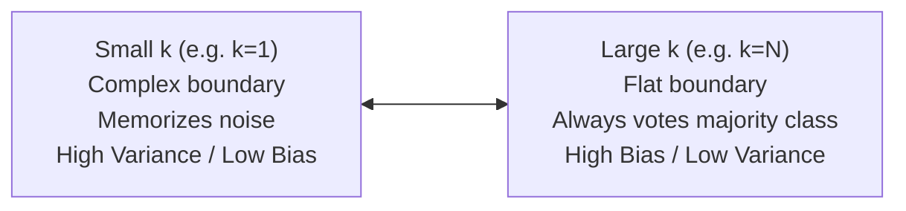

---
tags:
  - machine-learning/algorithm
  - supervised/instance-based
  - status/complete
aliases:
  - KNN
  - k-Nearest Neighbors
  - Nearest Neighbors
type: algorithm
paradigm: Supervised
task: Classification # and Regression
difficulty: Beginner
prerequisites:
  - "[[Linear Algebra for ML]]"
  - "[[Feature Engineering & Scaling]]"
created: 2026-08-17
---

# 👥 $k$-Nearest Neighbors ($k$-NN)

> [!summary] **Algorithm at a Glance**
> **Goal**: Non-parametric, instance-based "lazy learner". To classify a new query point $\mathbf{x}_{\text{new}}$, find the $k$ closest labeled training points in feature space and take a **majority vote** (or average for regression).  
> **Core Assumption**: Similar instances exist in close geometric proximity to one another.

---

## 🎯 Intuition & Mental Model

*"Birds of a feather flock together."*

```
         Feature 2
            ^
            |       (+) Class 1
            |     (+)  (+)
            |         \  k=3
            |          (?) <-- New Point
            |         /   \
            |       (o)   (o) Class 2
            +-------------------------> Feature 1
```

- When a new customer arrives, find the 5 customers most similar to them in age, salary, and habits. Predict that the new customer will buy what the majority of those 5 bought.

---

## 📐 Distance Metrics & Decision Rules

### 1. Distance Functions
Given points $\mathbf{u}, \mathbf{v} \in \mathbb{R}^d$:

- **Euclidean Distance ($L_2$)**: Straight-line distance:
  $$d(\mathbf{u}, \mathbf{v}) = \sqrt{\sum_{i=1}^d (u_i - v_i)^2}$$

- **Manhattan Distance ($L_1$)**: Grid / taxicab distance:
  $$d(\mathbf{u}, \mathbf{v}) = \sum_{i=1}^d |u_i - v_i|$$

- **Minkowski Distance ($L_p$)**: Generalization:
  $$d(\mathbf{u}, \mathbf{v}) = \left( \sum_{i=1}^d |u_i - v_i|^p \right)^{1/p}$$

---

### 2. The Decision Rule
$$
\hat{y}(\mathbf{x}) = \arg\max_{c} \sum_{i \in \mathcal{N}_k(\mathbf{x})} \mathbb{I}(y_i = c)
$$
*(Optional Distance-Weighted Voting: weight each neighbor's vote by $w_i = \frac{1}{d(\mathbf{x}, \mathbf{x}_i)}$).*

---

## ⚖️ The Impact of $k$ on Bias and Variance



> [!tip] **Rule of Thumb for Choosing $k$**
> - Set $k = \sqrt{N}$ as an initial heuristic.
> - Use an **odd number** for binary classification to eliminate tie votes (e.g., $k=3, 5, 7$).
> - Optimize $k$ using [[Cross-Validation & Data Splits]].

---

## ⚠️ The Curse of Dimensionality
As dimensionality $d$ increases:
- The volume of space grows exponentially ($V \propto r^d$).
- Data becomes exponentially sparse.
- The ratio of the distance to the nearest neighbor vs the farthest neighbor approaches $1.0$ ($\frac{d_{\max} - d_{\min}}{d_{\min}} \rightarrow 0$).
- **Remedy**: Always apply [[Principal Component Analysis (PCA)]] or feature selection before running KNN on high-dimensional data!

---

## 💻 Python Implementation (Scikit-Learn)

```python
from sklearn.datasets import load_iris
from sklearn.neighbors import KNeighborsClassifier
from sklearn.preprocessing import StandardScaler
from sklearn.pipeline import make_pipeline
from sklearn.model_selection import cross_val_score

X, y = load_iris(return_X_y=True)

# Mandatory: Scale features so high-magnitude features don't dominate distance
knn_pipeline = make_pipeline(
    StandardScaler(),
    KNeighborsClassifier(n_neighbors=5, weights='distance')
)

scores = cross_val_score(knn_pipeline, X, y, cv=5)
print(f"5-Fold CV Accuracy: {scores.mean() * 100:.2f}% (± {scores.std() * 100:.2f}%)")
```

---

## 🔗 Related Notes & Graph Connections
- **Unsupervised Counterpart**: [[K-Means & K-Means++]]
- **Foundations**: [[Linear Algebra for ML]], [[Feature Engineering & Scaling]]
- **Parent Hub**: [[Supervised Learning MOC]]
