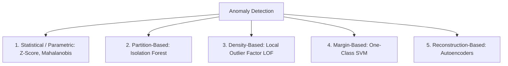

---
tags:
  - machine-learning/algorithm
  - unsupervised/anomaly-detection
  - status/complete
aliases:
  - Anomaly Detection
  - Outlier Detection
  - Isolation Forest
  - LOF
type: algorithm
paradigm: Unsupervised
task: Anomaly Detection
difficulty: Intermediate
prerequisites:
  - "[[Probability & Statistics for ML]]"
  - "[[Decision Trees]]"
created: 2026-08-17
---

# 🚨 Anomaly Detection Techniques

> [!summary] **Algorithm at a Glance**
> **Goal**: Identify rare observations, data points, or events that deviate significantly from the majority of normal data patterns.  
> **Key Real-World Challenge**: Anomalies are extremely rare ($< 1\%$) and unpredictable; supervised learning often lacks labeled fraud samples.

---

## 🧭 Taxonomy of Anomaly Detection



---

## 🌲 1. Isolation Forest (iForest) — The Tree-Based Champion

### 🎯 The Big Idea
Normal points reside in dense clusters and require **many random splits** to isolate.  
Anomalies reside in sparse, empty regions and are **isolated in very few splits**!

```
      Normal Point (Dense Cluster)                   Anomaly (Isolated Outlier)
          +-----------------------+                      +-----------------------+
          |   * * *   |           |                      | *                     |
          |  * (*) *  |           |                      |-----------------------| <-- Split 1
          |   * * *   |           |                      |   * * * *             |     Isolates the
          |-----------+-----------|                      |   * * * *             |     anomaly!
          |           |           |                      |   * * * *             |
          +-----------------------+                      +-----------------------+
          Requires 10+ random splits!                    Isolated in only 1 split!
```

### 📐 Anomaly Score Formula
For tree path length $h(\mathbf{x})$ and average path length $c(n)$ of an unsuccessful search in BST:

> [!math] **Isolation Score**
> $$
> s(\mathbf{x}, n) = 2^{-\frac{\mathbb{E}[h(\mathbf{x})]}{c(n)}}
> $$
> - If $\mathbb{E}[h(\mathbf{x})] \rightarrow 0 \implies s \rightarrow \mathbf{1.0}$ (Definite Anomaly).
> - If $\mathbb{E}[h(\mathbf{x})] \rightarrow n-1 \implies s \rightarrow \mathbf{0.0}$ (Normal Instance).

---

## 📍 2. Local Outlier Factor (LOF)

- Computes the local density of point $p$ compared to its $k$-nearest neighbors.
- $\text{LOF}(p) \approx 1.0 \implies$ Same density as neighbors (Normal).
- $\text{LOF}(p) \gg 1.0 \implies$ Much lower density than neighbors (Local Outlier).

---

## 💻 Python Implementation (Scikit-Learn IsolationForest)

```python
import numpy as np
from sklearn.ensemble import IsolationForest

# Generate 300 normal samples + 10 anomalous points
np.random.seed(42)
X_normal = np.random.normal(loc=0.0, scale=1.0, size=(300, 2))
X_anomalies = np.random.uniform(low=-6.0, high=6.0, size=(10, 2))
X_all = np.vstack([X_normal, X_anomalies])

# Fit Isolation Forest
# contamination: expected proportion of outliers
iso_forest = IsolationForest(contamination=0.03, random_state=42)
predictions = iso_forest.fit_predict(X_all) # +1: Normal, -1: Outlier

n_outliers = (predictions == -1).sum()
print(f"Total Outliers Flagged: {n_outliers} (Expected ~10)")
```

---

## 🔗 Related Notes & Graph Connections
- **Related Algorithms**: [[Decision Trees]], [[DBSCAN]]
- **Parent Hub**: [[Unsupervised Learning MOC]]
