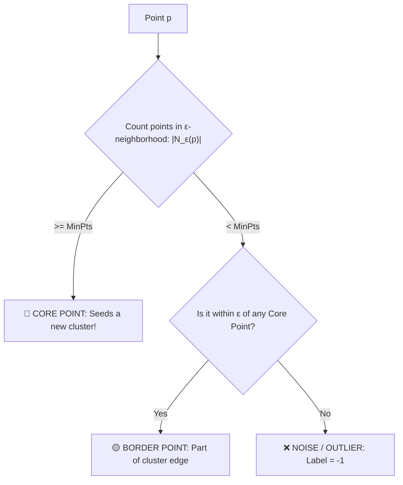

---
tags:
  - machine-learning/algorithm
  - unsupervised/clustering
  - status/complete
aliases:
  - DBSCAN
  - Density-Based Clustering
type: algorithm
paradigm: Unsupervised
task: Clustering
difficulty: Intermediate
prerequisites:
  - "[[K-Means & K-Means++]]"
created: 2026-08-17
---

# 🌌 DBSCAN: Density-Based Spatial Clustering with Noise

> [!summary] **Algorithm at a Glance**
> **Goal**: Discovers clusters of **arbitrary non-linear shapes** (crescents, rings, spirals) by grouping together closely packed points while marking low-density points in sparse regions as **noise / outliers ($-1$)**.  
> **Key Differentiator**: Does **NOT** require specifying the number of clusters $K$ in advance!

---

## 🎯 Intuition: Islands in an Ocean

While [[K-Means & K-Means++]] forces data into spherical blobs, DBSCAN looks at density:
- High-density landmasses become **Clusters**.
- Sparsely isolated points in the open ocean become **Noise**.

```
    * * * * *
  *           *   <-- Outer Ring (DBSCAN groups this cleanly as Cluster 1!)
 *    # # #    *
 *   #     #   *  <-- Inner Ring (DBSCAN groups this as Cluster 2!)
  *   # # #   *
    * * * * *
             .    <-- Isolated Dot (DBSCAN flags this as Noise = -1!)
```

---

## 📐 The 2 Hyperparameters & 3 Point Types

### 🎛️ The 2 Hyperparameters
1. **$\epsilon$ (Epsilon)**: The radius distance of the neighborhood around point $p$:
   $$N_\epsilon(p) = \{q \in \mathcal{D} : \text{dist}(p, q) \le \epsilon\}$$
2. **$\text{min\_samples}$ ($\text{MinPts}$)**: The minimum number of points required inside $N_\epsilon(p)$ to declare a dense region.

---

### 📍 The 3 Point Classifications



1. **Core Point**: Has at least $\text{MinPts}$ within distance $\epsilon$.
2. **Border Point**: Has fewer than $\text{MinPts}$ in its own neighborhood, but falls within $\epsilon$ of a Core Point.
3. **Noise Point**: Neither Core nor Border.

---

## 🧭 How to Choose $\epsilon$ (The $k$-Distance Plot)

1. Compute the distance from each point to its $k$-th nearest neighbor ($k = \text{min\_samples}$).
2. Sort all distances in ascending order and plot them.
3. The optimal $\epsilon$ is at the sharp **"knee / elbow"** of the curve!

```
k-Distance
  ^
  |               /
  |              /  <-- Rapid rise (sparse noise)
  |             /
  |      ______/    <-- Optimal ε at the inflection knee!
  |_____/           <-- Dense points
  +-------------------> Sorted Data Points
```

---

## 💻 Python Implementation (Scikit-Learn)

```python
from sklearn.datasets import make_moons
from sklearn.cluster import DBSCAN
from sklearn.preprocessing import StandardScaler

# Generate non-linear interlocking crescent moons
X, _ = make_moons(n_samples=300, noise=0.08, random_state=42)
X_scaled = StandardScaler().fit_transform(X)

# DBSCAN fits arbitrary shapes without knowing K
dbscan = DBSCAN(eps=0.3, min_samples=5)
labels = dbscan.fit_predict(X_scaled)

n_clusters = len(set(labels)) - (1 if -1 in labels else 0)
n_noise = list(labels).count(-1)

print(f"Estimated Clusters Found: {n_clusters}")
print(f"Noise Outliers Detected:  {n_noise}")
```

---

## 🔗 Related Notes & Graph Connections
- **Comparisons**: [[K-Means & K-Means++]], [[Hierarchical Clustering]]
- **Outlier Detection**: [[Anomaly Detection Techniques]]
- **Parent Hub**: [[Unsupervised Learning MOC]]
