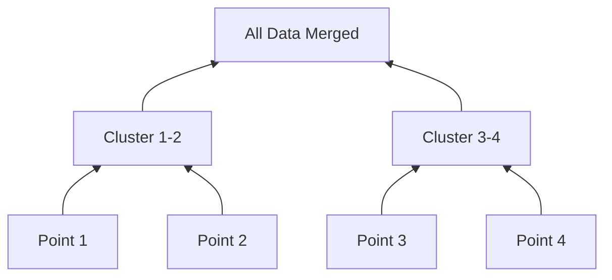

---
tags:
  - machine-learning/algorithm
  - unsupervised/clustering
  - status/complete
aliases:
  - Hierarchical Clustering
  - Agglomerative Clustering
  - Dendrogram
type: algorithm
paradigm: Unsupervised
task: Clustering
difficulty: Intermediate
prerequisites:
  - "[[K-Means & K-Means++]]"
created: 2026-08-17
---

# 🌳 Hierarchical Clustering & Dendrograms

> [!summary] **Algorithm at a Glance**
> **Goal**: Builds a nested hierarchy of clusters without needing to pre-specify the number of clusters $K$ beforehand.  
> **Primary Approach**: **Agglomerative (Bottom-Up)** starts with every point in its own cluster and iteratively merges the closest pair of clusters until all points form a single root.  
> **Key Visual Output**: The **Dendrogram**, a tree diagram showing the exact sequence and distance of merges.

---

## 🎯 Intuition: The Family Tree of Data

Imagine organizing a library:
1. First, pair identical edition books.
2. Next, group books by the same author.
3. Next, group authors by genre (Sci-Fi, History).
4. Finally, all genres merge into the "Library".

You can "slice" this hierarchy at any level to get 2 large macro-categories or 20 detailed sub-genres!



---

## 📐 Linkage Criteria (How Distance Between Clusters is Measured)

Given clusters $A$ and $B$:

| Linkage Criterion | Definition $D(A, B)$ | Characteristics & Behavior |
| :--- | :--- | :--- |
| **Ward's Linkage (Default)** | $\Delta \text{Inertia}$ after merge | Minimizes within-cluster variance; produces balanced, compact clusters |
| **Complete Linkage** | $\max \{d(\mathbf{a}, \mathbf{b}) : \mathbf{a} \in A, \mathbf{b} \in B\}$ | Most distant pair; produces tight, spherical clusters |
| **Single Linkage** | $\min \{d(\mathbf{a}, \mathbf{b}) : \mathbf{a} \in A, \mathbf{b} \in B\}$ | Closest pair; susceptible to the **chaining effect** (long stringy clusters) |
| **Average Linkage** | $\frac{1}{\|A\|\|B\|} \sum_{\mathbf{a} \in A} \sum_{\mathbf{b} \in B} d(\mathbf{a}, \mathbf{b})$ | Moderate compromise between single and complete |

---

## 📊 Reading a Dendrogram

```
Distance
  ^
  |        +-----------------------------------+  <-- High distance merge
  |        |                                   |
  |   +----+----+                         +----+----+  <-- Horizontal cut line (K=2)
  |   |         |                         |         |
  |  +-+       +-+                       +-+       +-+
  +---+---------+-------------------------+---------+---> Data Points
     (A)       (B)                       (C)       (D)
```

- **Vertical line height**: Represents the distance between the two clusters being merged.
- **Cutting the tree**: Draw a horizontal line across the dendrogram. The number of vertical lines intersected equals the number of resulting clusters ($K$).

---

## 💻 Python Implementation (Scipy & Scikit-Learn)

```python
import numpy as np
from sklearn.datasets import make_blobs
from sklearn.cluster import AgglomerativeClustering
from scipy.cluster.hierarchy import dendrogram, linkage

# Generate synthetic data
X, _ = make_blobs(n_samples=30, centers=3, random_state=42)

# 1. Compute linkage matrix for dendrogram
Z = linkage(X, method='ward')

# 2. Fit Scikit-Learn Agglomerative Clustering
agg = AgglomerativeClustering(n_clusters=3, metric='euclidean', linkage='ward')
labels = agg.fit_predict(X)
print(f"Assigned Cluster Labels for 30 points:\n{labels}")
```

---

## 🔗 Related Notes & Graph Connections
- **Comparison**: [[K-Means & K-Means++]], [[DBSCAN]]
- **Parent Hub**: [[Unsupervised Learning MOC]]
