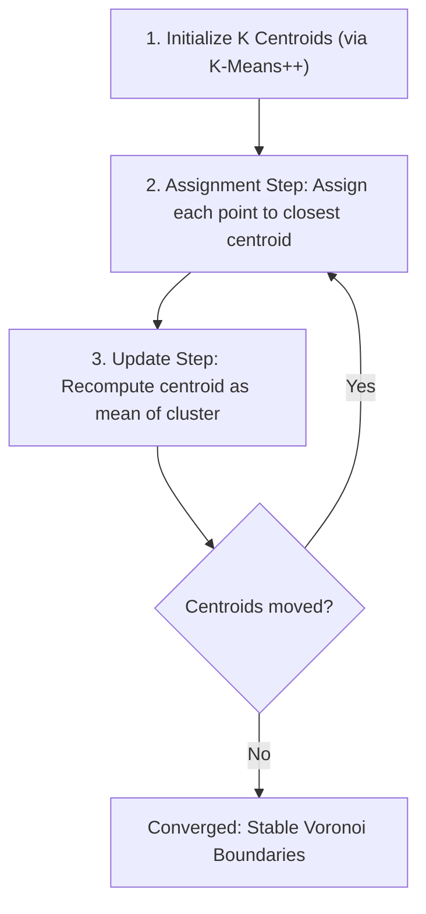

---
tags:
  - machine-learning/algorithm
  - unsupervised/clustering
  - status/complete
aliases:
  - K-Means
  - KMeans
  - K-Means++
  - Lloyd's Algorithm
type: algorithm
paradigm: Unsupervised
task: Clustering
difficulty: Beginner
prerequisites:
  - "[[Linear Algebra for ML]]"
  - "[[Feature Engineering & Scaling]]"
created: 2026-08-17
---

# 🎯 $K$-Means & $K$-Means++ Clustering

> [!summary] **Algorithm at a Glance**
> **Goal**: Partition $N$ unlabeled data points into $K$ distinct, non-overlapping clusters by iteratively assigning points to the nearest **cluster centroid** and updating centroids to the mean of their assigned points.  
> **Key Metric**: Minimizes **Inertia** (Within-Cluster Sum of Squares, WCSS).  
> **Smarter Initialization**: **$K$-Means++** prevents poor local minima by spreading out starting seeds proportionally to squared distance.

---

## 🎯 Intuition & Geometric Voronoi Tessellation

Think of $K$ politicians placing headquarters on a map to minimize travel distance for all their voters:



---

## 📐 Mathematical Formulation (Lloyd's Algorithm)

### 1. The Objective Function (Inertia / WCSS)
$$
J(\mathbf{\mu}_1, \dots, \mathbf{\mu}_K) = \sum_{k=1}^K \sum_{\mathbf{x}_i \in C_k} \|\mathbf{x}_i - \mathbf{\mu}_k\|_2^2
$$

---

### 2. The 2-Step Alternating Minimization
At each iteration $t$:
1. **Assignment Step** (holding centroids $\mathbf{\mu}$ fixed):
   $$
   C_k^{(t)} = \left\{ \mathbf{x}_i : \|\mathbf{x}_i - \mathbf{\mu}_k^{(t)}\|^2 \le \|\mathbf{x}_i - \mathbf{\mu}_j^{(t)}\|^2, \, \forall j \neq k \right\}
   $$
2. **Update Step** (holding assignments $C_k$ fixed):
   $$
   \mathbf{\mu}_k^{(t+1)} = \frac{1}{|C_k^{(t)}|} \sum_{\mathbf{x}_i \in C_k^{(t)}} \mathbf{x}_i
   $$

---

## ⚡️ The Initialization Trap: Why We Need $K$-Means++

As explored in [[Traditional Programming VS Machine Learning]]:
- **Random Initialization Flaw**: If standard K-Means picks starting centroids that happen to be close together (e.g., 3 apples), the algorithm gets trapped in a poor local minimum.

### 🌟 The $K$-Means++ Algorithm (Arthur & Vassilvitskii, 2007)
1. Choose the **first centroid** $\mathbf{\mu}_1$ uniformly at random from the dataset.
2. For each remaining point $\mathbf{x}$, compute $D(\mathbf{x})$, the shortest Euclidean distance to the closest already chosen centroid.
3. Select the next centroid with probability proportional to the **squared distance**:
   $$
   P(\mathbf{x}) = \frac{D(\mathbf{x})^2}{\sum_{\mathbf{x}'} D(\mathbf{x}')^2}
   $$
4. Repeat steps 2-3 until all $K$ centroids are chosen.

---

## 📏 How to Choose the Optimal $K$

```
Inertia (WCSS)
  ^
  |  \
  |   \
  |    \  <-- "Elbow Point" (Optimal K)
  |     \__________
  +-------------------> Number of Clusters (K)
```

1. **The Elbow Method**: Plot Inertia vs $K$. Look for the "elbow point" where rate of decrease sharply flattens.
2. **The Silhouette Score** ($s \in [-1, 1]$):
   $$s(i) = \frac{b(i) - a(i)}{\max(a(i), b(i))}$$
   - $a(i)$: Mean intra-cluster distance.
   - $b(i)$: Mean nearest-cluster distance.
   - Score $\approx 1.0 \implies$ dense, well-separated clusters.

---

## 💻 Python Implementation (Scikit-Learn)

```python
import numpy as np
from sklearn.datasets import make_blobs
from sklearn.cluster import KMeans
from sklearn.metrics import silhouette_score

# Generate 3 distinct clusters
X, _ = make_blobs(n_samples=500, centers=3, cluster_std=0.7, random_state=42)

# Fit KMeans with K-Means++ initialization
kmeans = KMeans(n_clusters=3, init='k-means++', n_init=10, random_state=42)
cluster_labels = kmeans.fit_predict(X)

print(f"Centroids:\n{kmeans.cluster_centers_}")
print(f"Final Inertia (WCSS): {kmeans.inertia_:.2f}")
print(f"Silhouette Score:     {silhouette_score(X, cluster_labels):.4f}")
```

---

## 🔗 Related Notes & Graph Connections
- **Vault Context**: [[Traditional Programming VS Machine Learning]] (Classification vs Clustering)
- **Alternative Clustering Algorithms**:
  - [[Hierarchical Clustering]] (Tree of clusters)
  - [[DBSCAN]] (Density-based non-spherical clusters)
- **Parent Hub**: [[Unsupervised Learning MOC]]
