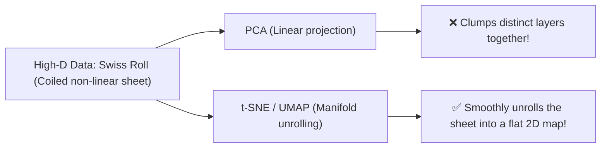

---
tags:
  - machine-learning/algorithm
  - unsupervised/manifold-learning
  - status/complete
aliases:
  - t-SNE
  - UMAP
  - Manifold Learning
type: algorithm
paradigm: Unsupervised
task: Dimensionality Reduction # Visualization
difficulty: Advanced
prerequisites:
  - "[[Principal Component Analysis (PCA)]]"
  - "[[Information Theory Basics]]"
created: 2026-08-17
---

# 🌀 Non-Linear Manifold Learning: $t$-SNE & UMAP

> [!summary] **Algorithm at a Glance**
> **Goal**: Map complex, curved, non-linear high-dimensional data manifolds into $2D$ or $3D$ space for **human visual exploration** while preserving neighborhood topologies.  
> **Key Players**:  
> - **$t$-SNE**: Gold standard for visualizing local clusters; converts Euclidean distances into conditional probabilities.  
> - **UMAP**: Faster, scales better, and preserves both **local and global** data geometry.

---

## 🧭 Why Linear PCA Fails on Complex Manifolds



---

## 🔬 1. $t$-SNE (t-Distributed Stochastic Neighbor Embedding)

### 📐 How $t$-SNE Works
1. **High-Dimensional Space (Gaussian Probabilities)**:
   The probability that point $\mathbf{x}_j$ is picked as neighbor to $\mathbf{x}_i$:
   $$p_{j \mid i} = \frac{\exp(-\|\mathbf{x}_i - \mathbf{x}_j\|^2 / 2\sigma_i^2)}{\sum_{k \neq i} \exp(-\|\mathbf{x}_i - \mathbf{x}_k\|^2 / 2\sigma_i^2)}$$
2. **Low-Dimensional Embedded Space (Student-$t$ Distribution)**:
   Uses a heavy-tailed Student-$t$ distribution (1 degree of freedom) to model low-dimensional distance $q_{ij}$:
   $$q_{ij} = \frac{(1 + \|\mathbf{y}_i - \mathbf{y}_j\|^2)^{-1}}{\sum_k \sum_{l \neq k} (1 + \|\mathbf{y}_k - \mathbf{y}_l\|^2)^{-1}}$$
   > [!tip] **The Crowding Problem Solution**
   > The heavy tails of the Student-$t$ distribution allow moderately distant points to be placed much farther apart in 2D space without blowing up error.

3. **Optimization**:
   Minimizes the **[[Information Theory Basics|KL Divergence]]** between $P$ and $Q$ via Gradient Descent:
   $$\mathcal{L} = D_{KL}(P \parallel Q) = \sum_i \sum_j p_{ij} \log\left(\frac{p_{ij}}{q_{ij}}\right)$$

---

## ⚡️ 2. UMAP (Uniform Manifold Approximation and Projection)

Founded in Riemannian geometry and fuzzy simplicial sets:
- **Major Advantages over $t$-SNE**:
  1. **Speed**: Orders of magnitude faster.
  2. **Global Structure**: Better preserves relative distances between distant clusters.
  3. **Transform capability**: Can project new, unseen test points into an existing embedding!

---

## ⚖️ High-Dimensional Visualization Showdown

| Dimension | **PCA** | **$t$-SNE** | **UMAP** |
| :--- | :--- | :--- | :--- |
| **Transformation Type** | Linear | Non-linear (Probabilistic) | Non-linear (Topological) |
| **Preserves** | Maximum Variance | **Local neighborhoods only** | **Local & Global structure** |
| **Speed / Scalability** | ⚡️⚡️ Blazing ($O(d^3)$ or SVD) | 🐢 Slow ($O(N^2)$ or Barnes-Hut) | ⚡️ Fast ($O(N \log N)$) |
| **Can Transform New Data?**| ✅ Yes | ❌ No (Must re-run on all data) | ✅ Yes |
| **Primary Use Case** | Preprocessing / Feature Reduction | Exploratory 2D Visualization | Visual clustering & Embeddings |

---

## 💻 Python Implementation (Scikit-Learn)

```python
from sklearn.datasets import load_digits
from sklearn.manifold import TSNE
import matplotlib.pyplot as plt

# Load digits dataset
digits = load_digits()
X, y = digits.data, digits.target

# Run t-SNE to project 64 dimensions -> 2 dimensions
tsne = TSNE(n_components=2, perplexity=30, random_state=42, init='pca', learning_rate='auto')
X_embedded = tsne.fit_transform(X)

print(f"Original Shape: {X.shape} -> Embedded Shape: {X_embedded.shape}")
```

---

## 🔗 Related Notes & Graph Connections
- **Linear Alternative**: [[Principal Component Analysis (PCA)]]
- **Foundations**: [[Information Theory Basics]] (KL Divergence)
- **Parent Hub**: [[Unsupervised Learning MOC]]
