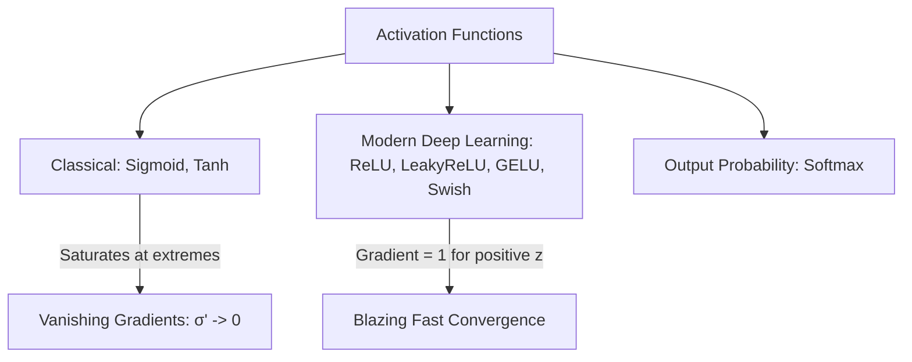

---
tags:
  - machine-learning/concept
  - deep-learning/components
  - status/complete
aliases:
  - Activation Functions
  - ReLU
  - GELU
  - Sigmoid
  - Softmax
type: concept
difficulty: Intermediate
prerequisites:
  - "[[Multivariate Calculus & Gradients]]"
created: 2026-08-17
---

# ⚡️ Non-Linear Activation Functions

> [!summary] **Core Intuition**
> Without non-linear activation functions, a neural network with 1,000 hidden layers is mathematically identical to a **single linear regression model** ($\mathbf{W}_3 \mathbf{W}_2 \mathbf{W}_1 \mathbf{x} = \mathbf{W}_{\text{combo}} \mathbf{x}$). Non-linearities allow neural networks to bend, twist, and warp coordinate space to fit arbitrarily complex surfaces.

---

## 🧭 The Activation Function Hall of Fame



---

## 📐 Mathematical Comparison Table

| Function | Formula $f(z)$ | Output Range | Derivative $f'(z)$ | Status / Best Use Case |
| :--- | :--- | :--- | :--- | :--- |
| **Sigmoid** | $\frac{1}{1 + e^{-z}}$ | $(0, 1)$ | $\sigma(z)(1 - \sigma(z))$ | Output layer of binary classifiers; historical hidden layers |
| **Tanh** | $\frac{e^z - e^{-z}}{e^z + e^{-z}}$ | $(-1, 1)$ | $1 - \tanh^2(z)$ | Zero-centered; used in RNN hidden states |
| **ReLU** | $\max(0, z)$ | $[0, \infty)$ | $\begin{cases} 1 & z > 0 \\ 0 & z < 0 \end{cases}$ | **Default baseline** for computer vision (CNNs) & MLPs |
| **Leaky ReLU** | $\max(\alpha z, z), \, \alpha \approx 0.01$ | $(-\infty, \infty)$ | $\begin{cases} 1 & z > 0 \\ \alpha & z < 0 \end{cases}$ | Prevents the "Dying ReLU" neuron death problem |
| **GELU** | $z \cdot \Phi(z)$ (Gaussian Error) | $(-0.17, \infty)$ | Smooth probabilistic | **Gold standard for modern Transformers (GPT, BERT, Llama)** |
| **Softmax** | $\frac{e^{z_i}}{\sum_j e^{z_j}}$ | $(0, 1), \, \sum = 1$ | $\text{diag}(\mathbf{p}) - \mathbf{p}\mathbf{p}^T$ | Multi-class classification output layer |

---

## ⚠️ The "Dying ReLU" Problem & Solutions

When large negative gradients push a ReLU neuron's bias so low that $z = \mathbf{w}^T \mathbf{x} + b < 0$ for all training points:
- The output becomes permanently $0$.
- The gradient $\frac{\partial f}{\partial z} = 0$, meaning weights never update again. The neuron is **dead**.
- **Solutions**:
  - Use **Leaky ReLU** or **GELU** which provide small non-zero gradients for negative inputs.
  - Lower the learning rate.
  - Initialize weights carefully using **He (Kaiming) Initialization**.

---

## 💻 Python Implementation (PyTorch)

```python
import torch
import torch.nn as nn

z = torch.tensor([-2.0, -0.5, 0.0, 0.5, 2.0])

print("Inputs:    ", z.numpy())
print("ReLU:      ", nn.ReLU()(z).numpy().round(3))
print("LeakyReLU: ", nn.LeakyReLU(negative_slope=0.01)(z).numpy().round(3))
print("GELU:      ", nn.GELU()(z).numpy().round(3))
print("Sigmoid:   ", nn.Sigmoid()(z).numpy().round(3))
print("Softmax:   ", nn.Softmax(dim=0)(z).numpy().round(3))
```

---

## 🔗 Related Notes & Graph Connections
- **Foundations**: [[Multivariate Calculus & Gradients]]
- **Applied In**:
  - [[Perceptrons & Multi-Layer Perceptrons]]
  - [[Convolutional Neural Networks (CNN)]]
  - [[Transformers & Attention]]
- **Parent Hub**: [[Deep Learning MOC]]
