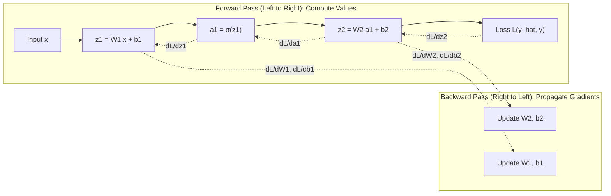

---
tags:
  - machine-learning/algorithm
  - deep-learning/foundations
  - status/complete
aliases:
  - Backpropagation
  - Backprop
  - Automatic Differentiation
  - Autograd
  - Computation Graphs
type: algorithm
paradigm: Supervised # Deep Learning
task: Optimization
difficulty: Advanced
prerequisites:
  - "[[Multivariate Calculus & Gradients]]"
  - "[[Perceptrons & Multi-Layer Perceptrons]]"
created: 2026-08-17
---

# 🔄 Backpropagation & Computation Graphs

> [!summary] **Algorithm at a Glance**
> **Goal**: Efficiently compute the partial derivatives of a scalar loss function $\mathcal{L}$ with respect to every weight and bias matrix in a deep neural network ($\frac{\partial \mathcal{L}}{\partial \mathbf{W}^{(l)}}, \frac{\partial \mathcal{L}}{\partial \mathbf{b}^{(l)}}$).  
> **Key Mechanism**: **Reverse-Mode Automatic Differentiation** applying the multivariate [[Multivariate Calculus & Gradients|Chain Rule]] backwards through a directed acyclic computational graph.

---

## 🎯 The Intuition: Blame Assignment

After a model makes a bad prediction, the final scalar loss $\mathcal{L}$ is high.
- **Backpropagation** walks backward from the final loss to the earliest layers.
- At each node, it calculates: *"How much is this specific weight responsible for the final error?"*
- Parameters that contributed heavily to the mistake receive large gradient updates.



---

## 📐 The 4 Fundamental Equations of Backpropagation

Let $\mathbf{\delta}^{(l)} \equiv \frac{\partial \mathcal{L}}{\partial \mathbf{z}^{(l)}}$ represent the "error vector" of layer $l$:

### 1. Error at the Output Layer ($L$)
> [!math] **Output Error**
> $$
> \mathbf{\delta}^{(L)} = \nabla_{\mathbf{a}^{(L)}} \mathcal{L} \odot \sigma'\left(\mathbf{z}^{(L)}\right)
> $$
*(For Softmax with Cross-Entropy Loss, this beautifully simplifies to $\mathbf{\delta}^{(L)} = \mathbf{\hat{p}} - \mathbf{y}$!)*

---

### 2. Backpropagating the Error to Preceding Layer ($l$)
> [!math] **Error Propagation**
> $$
> \mathbf{\delta}^{(l)} = \left( (\mathbf{W}^{(l+1)})^T \mathbf{\delta}^{(l+1)} \right) \odot \sigma'\left(\mathbf{z}^{(l)}\right)
> $$

---

### 3. Gradient with respect to Weights
> [!math] **Weight Gradient**
> $$
> \frac{\partial \mathcal{L}}{\partial \mathbf{W}^{(l)}} = \mathbf{\delta}^{(l)} \left(\mathbf{a}^{(l-1)}\right)^T
> $$

---

### 4. Gradient with respect to Biases
> [!math] **Bias Gradient**
> $$
> \frac{\partial \mathcal{L}}{\partial \mathbf{b}^{(l)}} = \mathbf{\delta}^{(l)}
> $$

---

## ⚠️ The Vanishing & Exploding Gradient Dilemma

Notice that propagating error through $K$ layers involves multiplying $K$ weight matrices and activation derivatives:

$$
\mathbf{\delta}^{(1)} \propto \mathbf{\delta}^{(L)} \prod_{l=1}^{L-1} \mathbf{W}^{(l+1)} \sigma'(\mathbf{z}^{(l)})
$$

- **Vanishing Gradients**: If activation derivatives are $< 1.0$ (like Sigmoid where $\sigma' \le 0.25$), multiplying them across 10 layers causes gradients to shrink exponentially ($0.25^{10} \approx 10^{-6}$). Early layers stop learning!
  - *Fix*: Use **[[Activation Functions|ReLU / GELU]]**, Residual Connections (ResNets), and Batch Normalization.
- **Exploding Gradients**: If weights are large ($> 1$), gradients explode to `NaN` / $\infty$.
  - *Fix*: Gradient Clipping and Xavier/He Weight Initialization.

---

## 💻 Python Demonstration (Micro-Autograd Engine)

```python
import torch

# PyTorch autograd handles computational graphs automatically!
x = torch.tensor([2.0, 3.0], requires_grad=True)
w = torch.tensor([1.5, -2.0], requires_grad=True)
b = torch.tensor(0.5, requires_grad=True)

# Forward pass
z = torch.dot(w, x) + b
a = torch.sigmoid(z)
loss = (a - 1.0) ** 2 # Dummy squared loss against target 1.0

# Backward pass (computes all partial derivatives in one line)
loss.backward()

print(f"Loss value: {loss.item():.4f}")
print(f"dL/dw:      {w.grad}")
print(f"dL/db:      {b.grad.item():.4f}")
```

---

## 🔗 Related Notes & Graph Connections
- **Underlying Math**: [[Multivariate Calculus & Gradients]]
- **Architectures**:
  - [[Perceptrons & Multi-Layer Perceptrons]]
  - [[Convolutional Neural Networks (CNN)]]
  - [[Transformers & Attention]]
- **Parent Hub**: [[Deep Learning MOC]]
