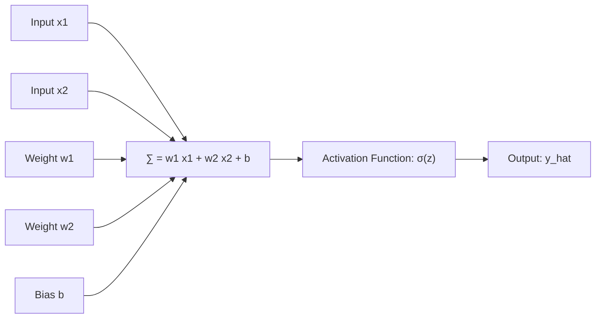

---
tags:
  - machine-learning/algorithm
  - deep-learning/foundations
  - status/complete
aliases:
  - Perceptrons
  - Multi-Layer Perceptrons
  - MLP
  - Neural Networks
  - Feedforward Neural Networks
type: algorithm
paradigm: Supervised # Deep Learning
task: Classification # and Regression
difficulty: Intermediate
prerequisites:
  - "[[Linear Algebra for ML]]"
  - "[[Activation Functions]]"
created: 2026-08-17
---

# 🧠 Perceptrons & Multi-Layer Perceptrons (MLP)

> [!summary] **Algorithm at a Glance**
> **Goal**: Feedforward artificial neural network architecture composed of stacked layers of parameterized artificial neurons with non-linear activations.  
> **Milestone Power**: The **Universal Approximation Theorem** proves that an MLP with just one hidden layer and non-linear activation can approximate *any* continuous function to arbitrary precision!

---

## 🎯 Biological vs Artificial Neuron

```
 Biological Neuron:   Dendrites (Inputs) ---> Cell Body (Summation) ---> Axon (Output)
 Artificial Neuron:   Inputs (x_1..x_d)  ---> Weighted Sum (w^T x + b) ---> Activation σ(z)
```



---

## 📜 The Historical Drama: The XOR Problem

In 1969, Minsky and Papert proved that a single-layer perceptron could only learn **linearly separable** functions (AND, OR), and could never learn the simple **XOR** (Exclusive OR) gate!

```
     XOR Truth Table                 Linear Inseparability
   x1  |  x2  | XOR(x1, x2)            x2
  -----+------+-------------           ^
   0   |  0   |      0                 |   (1)       (0)
   0   |  1   |      1                 |    *         o
   1   |  0   |      1                 |
   1   |  1   |      0                 |   (0)       (1)
                                       |    o         *
                                       +-------------------> x1
                                     No single line can separate!
```

> [!tip] **The Breakthrough**
> Adding just **one hidden layer** of non-linear neurons bends and warps the coordinate space, making XOR easily separable!

---

## 📐 Multi-Layer Forward Pass Equations

For an $L$-layer neural network:

> [!math] **Layer-by-Layer Forward Pass**
> For layer $l = 1, \dots, L$:
> $$
> \mathbf{z}^{(l)} = \mathbf{W}^{(l)} \mathbf{a}^{(l-1)} + \mathbf{b}^{(l)}
> $$
> $$
> \mathbf{a}^{(l)} = \sigma\left( \mathbf{z}^{(l)} \right)
> $$
> - $\mathbf{a}^{(0)} = \mathbf{x}$ is the input feature vector.
> - $\mathbf{W}^{(l)} \in \mathbb{R}^{n_l \times n_{l-1}}$ is the weight matrix for layer $l$.
> - $\mathbf{b}^{(l)} \in \mathbb{R}^{n_l}$ is the bias vector.
> - $\sigma(\cdot)$ is the non-linear [[Activation Functions|activation function]].
> - $\mathbf{\hat{y}} = \mathbf{a}^{(L)}$ is the final model prediction.

---

## 💻 Python Implementation (PyTorch & Scikit-Learn)

```python
import torch
import torch.nn as nn

# 2-layer Multi-Layer Perceptron in PyTorch
class SimpleMLP(nn.Module):
    def __init__(self, input_dim=10, hidden_dim=32, num_classes=2):
        super().__init__()
        self.network = nn.Sequential(
            nn.Linear(input_dim, hidden_dim),
            nn.ReLU(),
            nn.Linear(hidden_dim, num_classes)
        )
        
    def forward(self, x):
        return self.network(x)

# Instantiate and verify forward pass
model = SimpleMLP()
dummy_input = torch.randn(8, 10) # Batch size 8, 10 features
output = model(dummy_input)
print(f"Input Shape: {dummy_input.shape} -> Output Logits Shape: {output.shape}")
```

---

## 🔗 Related Notes & Graph Connections
- **Foundations**: [[Linear Algebra for ML]], [[Multivariate Calculus & Gradients]]
- **Critical Neural Components**:
  - [[Activation Functions]] (Why non-linearity is mandatory)
  - [[Backpropagation & Computation Graphs]] (How MLPs learn)
  - [[Gradient Descent & Optimizers]] (Updating weights)
- **Parent Hub**: [[Deep Learning MOC]]
