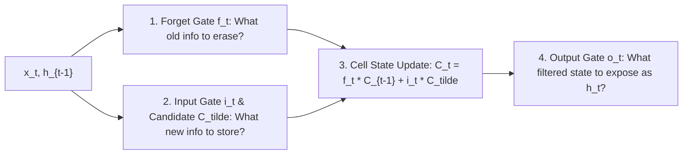

---
tags:
  - machine-learning/algorithm
  - deep-learning/sequences
  - status/complete
aliases:
  - RNN
  - LSTM
  - GRU
  - Recurrent Neural Networks
type: algorithm
paradigm: Supervised # Deep Learning
task: Sequence Modeling # NLP, Time-series
difficulty: Advanced
prerequisites:
  - "[[Perceptrons & Multi-Layer Perceptrons]]"
  - "[[Backpropagation & Computation Graphs]]"
created: 2026-08-17
---

# ⏳ Recurrent Neural Networks (RNN) & LSTM

> [!summary] **Algorithm at a Glance**
> **Goal**: Neural network architectures designed for **sequential temporal data** (time series, text sentences, audio, DNA sequences) by maintaining an internal **hidden memory state** $\mathbf{h}_t$ that carries context from previous time steps.  
> **Key Architecture**: **LSTM (Long Short-Term Memory)** introduces gated additive cell state highways to preserve long-range dependencies without vanishing gradients.

---

## 🎯 The Sequential Recurrence Principle

Unlike feedforward MLPs where every input is processed independently, an RNN processes a sequence token by token, updating its memory at each step:

```
Unrolled Through Time:
      y_1                y_2                y_T
       ^                  ^                  ^
       |                  |                  |
   +-------+          +-------+          +-------+
   | Cell  | --h_1--> | Cell  | --h_2--> | Cell  | --h_T-->
   +-------+          +-------+          +-------+
       ^                  ^                  ^
       |                  |                  |
      x_1                x_2                x_T
```

---

## 📐 1. Vanilla RNN Formulation

At time step $t$:

> [!math] **Vanilla RNN Hidden State Update**
> $$
> \mathbf{h}_t = \tanh\left( \mathbf{W}_{hh} \mathbf{h}_{t-1} + \mathbf{W}_{xh} \mathbf{x}_t + \mathbf{b}_h \right)
> $$
> $$
> \mathbf{\hat{y}}_t = \text{Softmax}\left( \mathbf{W}_{hy} \mathbf{h}_t + \mathbf{b}_y \right)
> $$

### ⚠️ Why Vanilla RNNs Fail: The BPTT Vanishing Gradient
Training uses **Backpropagation Through Time (BPTT)**. Computing the gradient of loss at time step $T$ with respect to $\mathbf{h}_1$ involves multiplying $T$ weight matrices $\prod_{k=1}^T \mathbf{W}_{hh}^T$. If the eigenvalues of $\mathbf{W}_{hh} < 1$, gradients vanish exponentially to $0$, making it impossible for the model to remember events from $>10$ steps ago.

---

## 🚪 2. Long Short-Term Memory (LSTM) Architecture

LSTM (Hochreiter & Schmidhuber, 1997) solves vanishing gradients by creating an uninterrupted **Cell State Highway** $\mathbf{C}_t$ regulated by **3 continuous multiplicative gates** ($\sigma \in [0, 1]$):



### 📐 The 4 LSTM Gate Equations

> [!math] **LSTM Formulas**
> 1. **Forget Gate**: Decides what percentage of old memory to keep:
>    $$\mathbf{f}_t = \sigma(\mathbf{W}_f [\mathbf{h}_{t-1}, \mathbf{x}_t] + \mathbf{b}_f)$$
> 2. **Input Gate & Candidate Memory**: Decides what new information to add:
>    $$\mathbf{i}_t = \sigma(\mathbf{W}_i [\mathbf{h}_{t-1}, \mathbf{x}_t] + \mathbf{b}_i), \quad \mathbf{\tilde{C}}_t = \tanh(\mathbf{W}_c [\mathbf{h}_{t-1}, \mathbf{x}_t] + \mathbf{b}_c)$$
> 3. **Cell State Update (Pure Linear Highway)**:
>    $$\mathbf{C}_t = \mathbf{f}_t \odot \mathbf{C}_{t-1} + \mathbf{i}_t \odot \mathbf{\tilde{C}}_t$$
> 4. **Output Gate & New Hidden State**:
>    $$\mathbf{o}_t = \sigma(\mathbf{W}_o [\mathbf{h}_{t-1}, \mathbf{x}_t] + \mathbf{b}_o), \quad \mathbf{h}_t = \mathbf{o}_t \odot \tanh(\mathbf{C}_t)$$

---

## ⚡️ 3. GRU (Gated Recurrent Unit)

A streamlined 2014 simplification of LSTM:
- Merges Cell State and Hidden State into a single $\mathbf{h}_t$.
- Combines Forget and Input gates into a single **Update Gate** $\mathbf{z}_t$, along with a **Reset Gate** $\mathbf{r}_t$.
- Faster to train with ~25% fewer parameters.

---

## 💻 Python Implementation (PyTorch)

```python
import torch
import torch.nn as nn

class LSTMSequenceClassifier(nn.Module):
    def __init__(self, vocab_size=1000, embed_dim=64, hidden_dim=128, num_classes=2):
        super().__init__()
        self.embedding = nn.Embedding(vocab_size, embed_dim)
        self.lstm = nn.LSTM(embed_dim, hidden_dim, batch_first=True)
        self.fc = nn.Linear(hidden_dim, num_classes)
        
    def forward(self, x):
        # x: (Batch, Sequence_Length)
        embeds = self.embedding(x) # (B, Seq_Len, Embed_Dim)
        out, (h_n, c_n) = self.lstm(embeds) # h_n is the final hidden state
        logits = self.fc(h_n.squeeze(0))
        return logits

# Verify dimensions
model = LSTMSequenceClassifier()
dummy_batch = torch.randint(0, 1000, (8, 25)) # Batch of 8 sentences, 25 words each
out = model(dummy_batch)
print(f"LSTM Output Logits Shape: {out.shape}") # (8, 2)
```

---

## 🔗 Related Notes & Graph Connections
- **Foundations**: [[Backpropagation & Computation Graphs]]
- **Modern Successor**: [[Transformers & Attention]] (Replaced recurrence with parallel self-attention)
- **Parent Hub**: [[Deep Learning MOC]]
