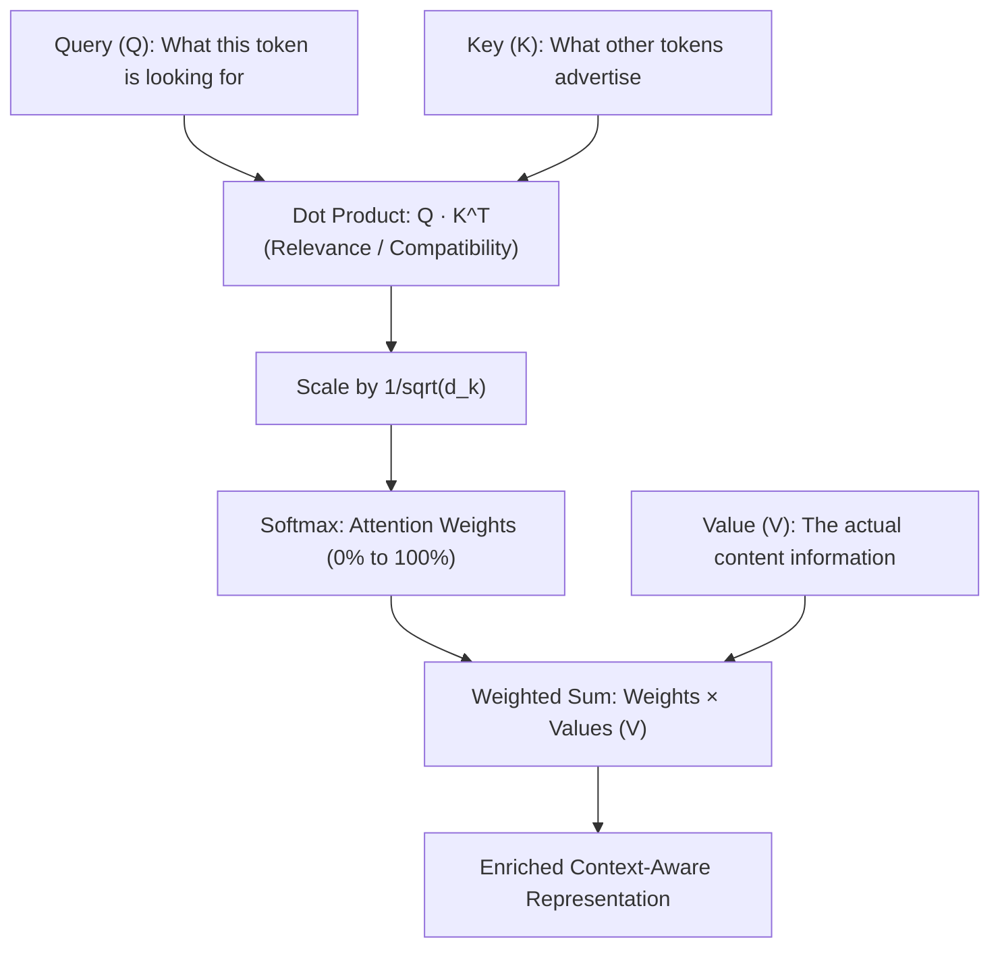

---
tags:
  - machine-learning/algorithm
  - deep-learning/transformers
  - llm
  - status/complete
aliases:
  - Transformers
  - Attention
  - Self-Attention
  - Multi-Head Attention
  - LLM Architecture
type: algorithm
paradigm: Supervised # Deep Learning / Self-Supervised
task: Foundation Models # NLP, Vision, Audio, Multimodal
difficulty: Advanced
prerequisites:
  - "[[Linear Algebra for ML]]"
  - "[[Perceptrons & Multi-Layer Perceptrons]]"
  - "[[Recurrent Neural Networks & LSTM]]"
created: 2026-08-17
---

# ⚡️ Transformers & The Attention Mechanism

> [!summary] **Algorithm at a Glance**
> **Goal**: Foundation architecture powering modern Generative AI, Large Language Models (GPT, Claude, Gemini, LLaMA), and Vision Transformers (ViT).  
> **Key Innovation**: Replaced sequential $O(T)$ recurrence with **parallelized Self-Attention**, allowing every token in a sequence to attend directly to every other token in $O(1)$ sequential operations.  
> **Milestone Paper**: *"Attention Is All You Need"* (Vaswani et al., NeurIPS 2017).

---

## 🎯 Intuition: The Database Analogy (Query, Key, Value)

Imagine searching for information in a modern search engine or library database:
- **Query ($Q$)**: What you are searching for (*"How old is the Eiffel Tower?"*).
- **Key ($K$)**: The title / indexing tags of all available documents.
- **Value ($V$)**: The actual content / text inside each document.



---

## 📐 1. Scaled Dot-Product Attention

Given matrices $\mathbf{Q} \in \mathbb{R}^{T \times d_k}, \mathbf{K} \in \mathbb{R}^{T \times d_k}, \mathbf{V} \in \mathbb{R}^{T \times d_v}$:

> [!math] **Scaled Dot-Product Attention Formula**
> $$
> \text{Attention}(\mathbf{Q}, \mathbf{K}, \mathbf{V}) = \text{Softmax}\left( \frac{\mathbf{Q} \mathbf{K}^T}{\sqrt{d_k}} \right) \mathbf{V}
> $$

- **Why divide by $\sqrt{d_k}$?**: For large embedding dimensions (e.g., $d_k = 128$), dot products grow large in magnitude, pushing the Softmax function into regions with near-zero gradients. Scaling stabilizes gradients!

---

## 👥 2. Multi-Head Attention (MHA)

Instead of performing a single attention function, project Queries, Keys, and Values $h$ times with different learned linear projections:

> [!math] **Multi-Head Attention**
> $$
> \text{MultiHead}(\mathbf{Q}, \mathbf{K}, \mathbf{V}) = \text{Concat}(\text{head}_1, \dots, \text{head}_h) \mathbf{W}^O
> $$
> $$\text{where } \text{head}_i = \text{Attention}(\mathbf{Q}\mathbf{W}_i^Q, \mathbf{K}\mathbf{W}_i^K, \mathbf{V}\mathbf{W}_i^V)$$

- **Why Multi-Head?**: Allows the model to attend simultaneously to different types of relationships (e.g., Head 1 tracks grammar agreement, Head 2 tracks pronoun resolution, Head 3 tracks temporal verbs).

---

## 🧱 3. The Complete Transformer Block Anatomy

```
               Output Representation
                         ^
                         |
                 [ LayerNorm ]
                         |
                   (+)---+  <-- Residual Connection 2
                   /     |
         [ Feed-Forward Network ] (MLP: Linear -> GELU -> Linear)
                   \     |
                 [ LayerNorm ]
                         |
                   (+)---+  <-- Residual Connection 1
                   /     |
      [ Multi-Head Self-Attention ]
                   \     |
                 [ LayerNorm ]
                         ^
                         |
           Input Embeddings + Positional Encodings
```

- **Positional Encoding**: Because matrix self-attention is permutation-invariant, positional vectors (Sinusoidal, Learned, or RoPE) are added to input embeddings to convey sequence order.

---

## 🏛️ The 3 Main Transformer Families

| Architecture Type | Attention Masking | Representative Models | Best For |
| :--- | :--- | :--- | :--- |
| **Encoder-Only** | Bidirectional (Looks left & right) | **BERT**, RoBERTa | Classification, NER, Embeddings, Search |
| **Decoder-Only** | Causal Mask (Looks only at past tokens) | **GPT-4**, LLaMA 3, Claude, Gemini | **Autoregressive Text Generation & Chat** |
| **Encoder-Decoder** | Cross-Attention between Encoder & Decoder | **T5**, BART, Whisper | Translation, Summarization, Speech-to-Text |

---

## 💻 Python Implementation (Multi-Head Attention from Scratch)

```python
import torch
import torch.nn as nn
import math

class SelfAttention(nn.Module):
    def __init__(self, embed_dim=64, num_heads=4):
        super().__init__()
        assert embed_dim % num_heads == 0
        self.d_k = embed_dim // num_heads
        self.num_heads = num_heads
        
        # Combined projection for Q, K, V
        self.qkv_proj = nn.Linear(embed_dim, 3 * embed_dim)
        self.out_proj = nn.Linear(embed_dim, embed_dim)
        
    def forward(self, x):
        B, T, C = x.shape # Batch, Time/Tokens, Embedding Dim
        
        # Project and split into Q, K, V
        qkv = self.qkv_proj(x).reshape(B, T, 3, self.num_heads, self.d_k).permute(2, 0, 3, 1, 4)
        q, k, v = qkv[0], qkv[1], qkv[2] # Shape: (B, heads, T, d_k)
        
        # Scaled dot-product attention
        scores = (q @ k.transpose(-2, -1)) / math.sqrt(self.d_k) # (B, heads, T, T)
        attn_weights = torch.softmax(scores, dim=-1)
        
        out = attn_weights @ v # (B, heads, T, d_k)
        out = out.permute(0, 2, 1, 3).reshape(B, T, C) # Concatenate heads
        return self.out_proj(out)

# Verify execution
attn = SelfAttention(embed_dim=64, num_heads=4)
x_tokens = torch.randn(2, 16, 64) # Batch 2, 16 tokens, 64-d embeddings
out = attn(x_tokens)
print(f"Input Shape: {x_tokens.shape} -> Attention Output Shape: {out.shape}")
```

---

## 🔗 Related Notes & Graph Connections
- **Foundations**: [[Linear Algebra for ML]], [[Activation Functions]] (GELU, Softmax)
- **Predecessors**: [[Recurrent Neural Networks & LSTM]], [[Convolutional Neural Networks (CNN)]]
- **Parent Hub**: [[Deep Learning MOC]]
