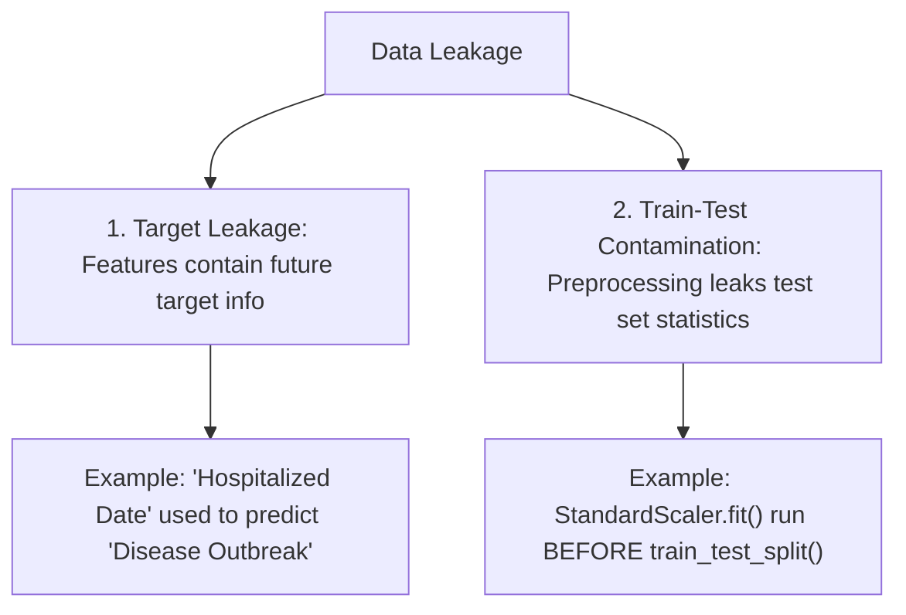

---
tags:
  - machine-learning/concept
  - validation
  - data-quality
  - status/complete
aliases:
  - Data Leakage
  - Target Leakage
  - Train-Test Contamination
type: concept
difficulty: Intermediate
prerequisites:
  - "[[Cross-Validation & Data Splits]]"
  - "[[Feature Engineering & Scaling]]"
created: 2026-08-17
---

# 🕵️ Data Leakage & How to Avoid It

> [!danger] **The Silent Killer of Machine Learning Projects**
> **Data Leakage** occurs when information from outside the training dataset (such as target labels or future test data) is inadvertently used to train the model. The model achieves unrealistic $99.9\%$ validation accuracy in your notebook, but **fails completely** when deployed to production.

---

## 🧭 The 2 Primary Types of Data Leakage



---

## 🚫 1. Target Leakage (Features from the Future)

Occurs when a predictor variable includes data that would **not be available at the exact moment of prediction in production**.

### 🔍 Classic Real-World Examples:
1. **Pneumonia Prediction**: A feature called `received_antibiotic_injection` had 100% predictive power. Why? Doctors only gave the antibiotic *after* diagnosing pneumonia! In production, new undiagnosed patients haven't received antibiotics yet.
2. **Customer Churn**: A feature called `churn_survey_rating` or `cancellation_fee_billed` exists only *after* the customer has already initiated churn.

> [!tip] **How to Prevent Target Leakage**
> For every feature in your dataset, ask:  
> *"At the exact microsecond when this model makes a live production prediction, will this feature exist and be legally/physically accessible?"*

---

## 🚫 2. Train-Test Contamination (Preprocessing Leakage)

Occurs when test/validation data statistics (mean $\mu$, variance $\sigma^2$, min/max, frequency counts) leak into training data transformations.

### ❌ The Bad Code (Common Beginner Mistake):
```python
# ❌ DANGEROUS LEAKAGE: Scaler learns test set mean and standard deviation!
scaler = StandardScaler()
X_scaled = scaler.fit_transform(X) # Leaked the entire dataset!

X_train, X_test, y_train, y_test = train_test_split(X_scaled, y)
```

### ✅ The Correct Code (Pipeline Encapsulation):
```python
# ✅ SAFE: Split first, fit scaler ONLY on training fold
X_train, X_test, y_train, y_test = train_test_split(X, y)

pipeline = make_pipeline(StandardScaler(), LogisticRegression())
pipeline.fit(X_train, y_train) # Fits scaler ONLY on X_train!
```

---

## 🛡️ The Anti-Leakage Golden Rules

| Leakage Source | Root Cause | Universal Fix |
| :--- | :--- | :--- |
| **Preprocessing** | Fitting transformers on full dataset | Always wrap transformations in `sklearn.pipeline.Pipeline` |
| **Time-Series** | Random shuffle predicting past from future | Use `TimeSeriesSplit` (Walk-Forward validation) |
| **Grouped Entities** | Multiple rows per user/patient split across folds | Use `GroupKFold` so no patient appears in both folds |
| **Target Encoding** | Computing target averages using the whole column | Use out-of-fold target encoding with smoothing |

---

## 🔗 Related Notes & Graph Connections
- **Connected Concepts**:
  - [[Cross-Validation & Data Splits]]
  - [[Feature Engineering & Scaling]]
  - [[End-to-End ML Project Checklist]]
- **Parent Hub**: [[Machine Learning MOC]]
