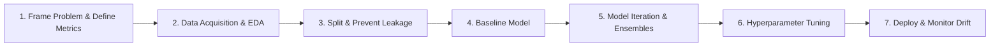

---
tags:
  - machine-learning/workflow
  - mloops
  - status/complete
aliases:
  - ML Project Checklist
  - End-to-End ML Workflow
  - ML Lifecycle
type: workflow
difficulty: Beginner
prerequisites: []
created: 2026-08-17
---

# 🚀 End-to-End Machine Learning Project Checklist

> [!summary] **Core Intuition**
> Building a production-grade machine learning system involves far more than fitting a model. Real-world ML is an **iterative engineering lifecycle**: from problem definition and data quality audits to leakage prevention, metric alignment, and continuous monitoring.

---

## 🧭 The 7-Stage Machine Learning Lifecycle

---

## 📋 The Step-by-Step Checklist

### 🎯 Stage 1: Problem Framing & Business Alignment
- [ ] What is the core business objective? (e.g., reduce customer churn by 5%).
- [ ] What ML paradigm fits? (Supervised [[Supervised Learning MOC|Classification/Regression]], [[Unsupervised Learning MOC|Clustering]], Recommendation).
- [ ] Define the evaluation metric: Is False Positive or False Negative worse? ([[Evaluation Metrics for ML]]).
- [ ] Define the minimum viable benchmark: What simple heuristic or non-ML rule are we trying to beat?

---

### 📊 Stage 2: Exploratory Data Analysis (EDA) & Data Auditing
- [ ] Inspect dataset shape, data types, and missing values.
- [ ] Check class distributions: Is there severe class imbalance?
- [ ] Detect outliers and impossible values (e.g., negative ages).
- [ ] Examine feature correlations with target variable.

---

### 🛡️ Stage 3: Splitting & Data Leakage Prevention
- [ ] **Split data IMMEDIATELY** before any preprocessing or feature engineering! ([[Cross-Validation & Data Splits]]).
- [ ] Is data temporal? Use Time-Series Walk-Forward Split.
- [ ] Are there group dependencies (e.g., multiple rows per user)? Use GroupKFold.
- [ ] Review [[Data Leakage & How to Avoid It]] checklist.

---

### 🛠️ Stage 4: Feature Engineering & Preprocessing Pipelines
- [ ] Handle missing values (Imputation).
- [ ] Scale numerical features ([[Feature Engineering & Scaling]]).
- [ ] Encode categorical features (One-Hot, Ordinal, Target Encoding).
- [ ] Bundle transformations into a strict `sklearn.pipeline.Pipeline` or `ColumnTransformer`.

---

### 🤖 Stage 5: Model Selection & Iterative Experimentation
- [ ] Train a fast dummy baseline (e.g., `DummyClassifier` or simple [[Logistic Regression]]).
- [ ] Train a diverse portfolio of models:
  - Linear Model: [[Logistic Regression]] / [[Linear Regression]]
  - Tree Ensemble: [[Random Forests]]
  - Gradient Booster: [[Gradient Boosting & XGBoost]] (LightGBM/CatBoost)
  - Non-linear / Distance: [[Support Vector Machines (SVM)]] / [[k-Nearest Neighbors (KNN)]]
- [ ] Compare cross-validation metrics across all models.

---

### 🎛️ Stage 6: Hyperparameter Optimization & Error Analysis
- [ ] Tune top 2 promising candidates using Bayesian Optimization / Optuna ([[Hyperparameter Tuning]]).
- [ ] Inspect the Confusion Matrix and perform **Error Analysis** on misclassified samples.
- [ ] Evaluate final champion model **ONCE** on the held-out Test Set.

---

### 🚢 Stage 7: Deployment, Serving & Monitoring
- [ ] Export model artifacts (`onnx`, `joblib`, or containerized API).
- [ ] Set up latency benchmarks (P99 inference latency in ms).
- [ ] Monitor for **Data Drift** (inputs change over time) and **Concept Drift** (target relationship changes).

---

## 🔗 Related Notes & Graph Connections
- **Data Safeguards**: [[Data Leakage & How to Avoid It]]
- **Optimization**: [[Hyperparameter Tuning]]
- **Hub**: [[Machine Learning MOC]]
