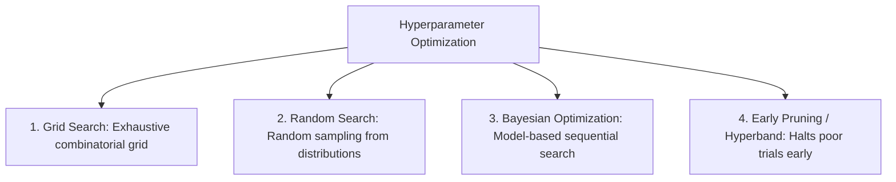

---
tags:
  - machine-learning/concept
  - optimization
  - workflow
  - status/complete
aliases:
  - Hyperparameter Tuning
  - Grid Search
  - Random Search
  - Bayesian Optimization
  - Optuna
type: concept
difficulty: Intermediate
prerequisites:
  - "[[Cross-Validation & Data Splits]]"
  - "[[Evaluation Metrics for ML]]"
created: 2026-08-17
---

# 🎛️ Hyperparameter Tuning & Optimization

> [!summary] **Core Intuition**
> - **Model Parameters** (e.g., weights $\mathbf{w}$, bias $b$, tree split points) are learned **automatically from data** during training.
> - **Hyperparameters** (e.g., learning rate $\eta$, tree depth `max_depth`, regularization $\lambda$, neighbor count $k$) are structural knobs set **before training**. Hyperparameter tuning is the search for the optimal knob configuration.

---

## 🧭 The 4 Hyperparameter Search Strategies



---

## 🔍 Strategy Comparison

```
     Grid Search (9 Trials)                    Random Search (9 Trials)
     Param 2                                   Param 2
     ^                                         ^
     |   *   *   *                             |     *      *
     |                                         |           *     *
     |   *   *   *                             |   *                  *
     |                                         |       *      *
     |   *   *   *                             |                    *
     +---------------+--------> Param 1        +---------------+--------> Param 1
   Only 3 distinct values of Param 1!       Explores 9 distinct values of Param 1!
```

| Strategy | Methodology | Efficiency | When to Use |
| :--- | :--- | :--- | :--- |
| **Grid Search** (`GridSearchCV`) | Evaluates every Cartesian product combination | 🐢 Exponentially slow ($O(S^H)$) | $\le 2$ parameters with small discrete candidate sets |
| **Random Search** (`RandomizedSearchCV`) | Samples combinations randomly from continuous distributions | ⚡️ 10x more efficient than Grid Search (Bergstra & Bengio, 2012) | Standard baseline for $3 \sim 6$ parameters |
| **Bayesian Optimization** (Optuna / Hyperopt) | Trains a surrogate probabilistic model (TPE) to predict performance of untried configs | ⭐️⭐️⭐️⭐️⭐️ **State-of-the-Art** (Intelligent exploration vs exploitation) | Complex models (XGBoost, Deep Neural Networks) |

---

## 💻 Python Implementation (Random Search & Optuna)

### 1. Scikit-Learn RandomizedSearchCV
```python
from sklearn.datasets import load_wine
from sklearn.ensemble import RandomForestClassifier
from sklearn.model_selection import RandomizedSearchCV
from scipy.stats import randint

X, y = load_wine(return_X_y=True)

param_distributions = {
    'n_estimators': randint(50, 300),
    'max_depth': randint(3, 15),
    'min_samples_split': randint(2, 10),
    'max_features': ['sqrt', 'log2', None]
}

random_search = RandomizedSearchCV(
    estimator=RandomForestClassifier(random_state=42),
    param_distributions=param_distributions,
    n_iter=20, # 20 random trials
    cv=5,
    scoring='accuracy',
    random_state=42,
    n_jobs=-1
)

random_search.fit(X, y)
print(f"Best Accuracy: {random_search.best_score_ * 100:.2f}%")
print(f"Best Hyperparameters: {random_search.best_params_}")
```

### 2. Modern Bayesian Optimization with Optuna
```python
import optuna
from sklearn.metrics import accuracy_score
from sklearn.model_selection import cross_val_score
from sklearn.ensemble import RandomForestClassifier

def objective(trial):
    n_estimators = trial.suggest_int('n_estimators', 50, 300)
    max_depth = trial.suggest_int('max_depth', 3, 15)
    min_samples_split = trial.suggest_int('min_samples_split', 2, 10)
    
    clf = RandomForestClassifier(
        n_estimators=n_estimators,
        max_depth=max_depth,
        min_samples_split=min_samples_split,
        random_state=42
    )
    return cross_val_score(clf, X, y, cv=5).mean()

# Optimize objective over 30 intelligent trials
study = optuna.create_study(direction='maximize')
study.optimize(objective, n_trials=30)

print(f"Optuna Best CV Score: {study.best_value * 100:.2f}%")
print(f"Optuna Best Parameters: {study.best_params}")
```

---

## 🔗 Related Notes & Graph Connections
- **Connected Concepts**:
  - [[Cross-Validation & Data Splits]]
  - [[Bias-Variance Tradeoff]]
  - [[End-to-End ML Project Checklist]]
- **Parent Hub**: [[Machine Learning MOC]]
