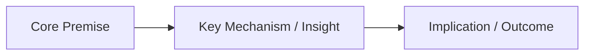

---
tags:
  - zettelkasten
  - atomic-note
  - status/evergreen # status/seed | status/growing | status/evergreen
aliases: []
type: zettel
created: {{date}}
updated: {{date}}
---

# 💡 {{title}}

> [!summary] **Core Thesis / Claim in 1 Sentence**
> A single, declarative, atomic statement summarizing the essential idea of this note.

---

## 🧠 The Idea & Explanation
- **Explanation**: 
- **Context / Why it matters**: 

---

## 🔍 Supporting Evidence & Intuitions
- **Real-World Analogy**: 
- **Data / Arguments / Proof**: 

---

## ⚖️ Counterarguments & Edge Cases
- **When does this NOT hold true?**: 
- **Limitations**: 

---

## 🔗 Second Brain Graph Connections
- **Upward (Parent Hub)**: [[MOC Template|Parent MOC]]
- **Downward (Specific Examples / Children)**: 
- **Lateral (Related Concepts / Counterparts)**: 
- **Opposing Ideas**: 
- **Source Material**: [[Source Note / Literature]]
