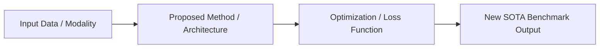

---
tags:
  - paper
  - literature
  - research
  - status/unread # status/unread | status/reading | status/reviewed
aliases: []
type: paper
authors: []
year: 
venue: # e.g. NeurIPS, ICML, CVPR, ICLR, arXiv
doi: 
url: 
code_url: 
created: {{date}}
---

# 📄 Research Paper: {{title}}

> [!summary] **Executive Summary in 2 Sentences**
> What is the core problem being addressed, the proposed method, and the headline benchmark result?

---

## 🎯 1. Problem Statement & Motivation
- **Context**: 
- **The Core Flaw in Existing Approaches**: 
- **The Key Research Hypothesis**: 

---

## ⚙️ 2. Methodology & Architecture

- **Mathematical Innovation**:
  $$
  
  $$
- **Key Algorithmic Mechanism**: 

---

## 🧪 3. Key Experiments & Benchmark Results
| Dataset / Benchmark | Baseline Metric | Proposed Method Metric | Improvement |
| :--- | :--- | :--- | :--- |
| • | • | • | • |

---

## 🔍 4. Critical Takeaways & Critique
### 🟢 Strengths
- 

### 🔴 Limitations & Unanswered Questions
- 

---

## 🔗 Second Brain Graph Connections
- **Underlying Foundations**: [[Linear Algebra for ML]], [[Multivariate Calculus & Gradients]]
- **Parent Hub**: [[Deep Learning MOC]] / [[Machine Learning MOC]]
- **Atomic Notes Created from this Paper**:
  - [[Atomic Note Template]]
