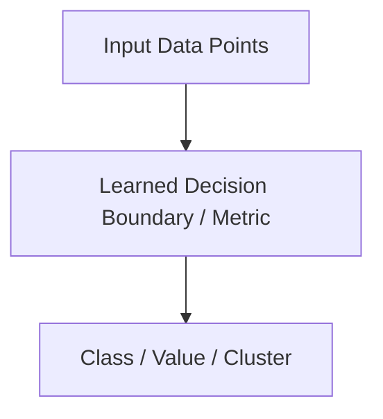

---
tags:
  - machine-learning/algorithm
  - status/draft
aliases: []
type: algorithm
paradigm: Supervised # Supervised | Unsupervised | Reinforcement
task: Classification # Classification | Regression | Clustering | Dimensionality Reduction
difficulty: Intermediate # Beginner | Intermediate | Advanced
prerequisites: []
created: {{date}}
---
# {{title}}

> [!summary] **Algorithm at a Glance**
> **Goal**: 
> **Input $\rightarrow$ Output**: $\mathbf{X} \in \mathbb{R}^{n \times d} \rightarrow \mathbf{y} \in \mathbb{R}^n$ (or clusters/embeddings)
> **Key Assumption**: 

---

## 🎯 Intuition & Mental Model
### The Big Picture
- 

### Geometric / Physical Interpretation


---

## 📐 Mathematical Formulation

### 1. Objective / Optimization Function
> [!math] **Optimization Target**
> $$
> \min_{\theta} \mathcal{L}(\theta) = \dots
> $$

### 2. Decision Rule / Inference
$$
\hat{y} = f(\mathbf{x}; \mathbf{\theta}) = \dots
$$

---

## ⚙️ How the Algorithm Works (Step-by-Step)
1. **Initialization**:
2. **Training / Fitting**:
3. **Convergence Criterion**:
4. **Prediction / Inference**:

---

## ⚖️ Strengths, Weaknesses & Assumptions
| Strengths (Pros) | Weaknesses (Cons) | Core Assumptions |
| :--- | :--- | :--- |
| • | • | • |

---

## 💻 Python Implementation (From Scratch & Scikit-Learn)

### Scikit-Learn Pipeline
```python
from sklearn.model_selection import train_test_split
from sklearn.metrics import classification_report

# Example pipeline
```

---

## 🧪 Practical Tips & Hyperparameter Guide
- **Key Hyperparameters**:
  - `param_1`: 
- **When to Choose Over Other Models**:
- **Common Failure Modes**:

---

## 🔗 Related Notes & Graph Connections
- **Related Algorithms**: 
- **Underlying Foundations**: 
- **Parent Hub**: [[Machine Learning MOC]]
