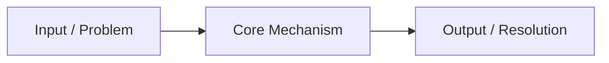

---
tags:
  - machine-learning/concept
  - status/draft
aliases: []
type: concept
difficulty: Beginner # Beginner | Intermediate | Advanced
prerequisites: []
created: {{date}}
---
# {{title}}

> [!summary] **Core Intuition**
> A 1-2 sentence high-level summary of what this concept is and why it exists.

---

## 🎯 What Problem Does This Solve?
- **Context**: 
- **The Core Problem**: 
- **The Solution/Insight**: 

---

## 🧠 Conceptual Explanation & Intuition
### Real-World Analogy
- 

### Visual / Mental Model


---

## 📐 Mathematical Formulation
> [!math] **Key Definition / Equation**
> $$
> 
> $$

- **Notation Breakdown**:
  - $x$: 
  - $y$: 

---

## ⚖️ Tradeoffs & Nuances
| Advantage / Pro | Limitation / Con |
| :--- | :--- |
| • | • |
| • | • |

---

## 💻 Code Demonstration (Python)
```python
import numpy as np

# Quick reproducible demonstration
```

---

## 🔗 Related Notes & Graph Connections
- **Prerequisites**: 
- **Builds Into**: 
- **Related Concepts**: 
- **Parent Hub**: [[Machine Learning MOC]]
